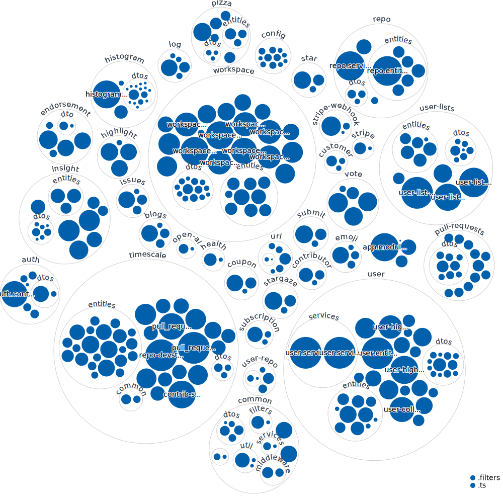

<div align="center">
  <br>
  
  <h1>🍕 Open Sauced Insights API 🍕</h1>
  <strong>The path to your next Open Source contribution</strong>
  <br>
  <br>
  <a href="https://www.digitalocean.com/?refcode=c65a90d0956d&utm_campaign=Referral_Invite&utm_medium=Referral_Program&utm_source=badge"></a>
</div>
<br>
<p align="center">
  
  
  <a href="https://github.com/open-sauced/api.opensauced.pizza/issues">
    
  </a>
  <a href="https://github.com/open-sauced/api.opensauced.pizza/releases">
    
  </a>
  <a href="https://discord.gg/U2peSNf23P">
    
  </a>
  <a href="https://twitter.com/saucedopen">
    
  </a>
</p>

## 🚀 Live release environments

- [api.opensauced.pizza](https://api.opensauced.pizza/)
- [beta.api.opensauced.pizza](https://beta.api.opensauced.pizza/)

## 📖 Prerequisites

In order to run the project we need the following software binaries installed on our development machines:

- `node>=16.7.0`
- `npm>=8.0.0`
- `docker>=20.10.12`

## 🖥️ Local development

## 📡 Setting Up Your Supabase Instance

Before setting up your local PostgreSQL database, a Supabase instance should be created. To do this, follow these steps:

**1. Create a new Supabase project:** Visit [Supabase](https://supabase.com/) and create a new project.

**2. Set Environment Variables in .env file:** Once your project is created, Supabase will provide a URL and an API key. Set these in your project's `.env` file:

```
SUPABASE_URL=your_supabase_url
SUPABASE_API_KEY=your_supabase_api_key
SUPABASE_JWT_SECRET=your_supabase_jwt_secret
API_DOMAIN=your_api_domain
```

Replace `your_supabase_url`, `your_supabase_api_key`, `your_supabase_jwt_secret`, and `your_api_domain` with the actual values provided by Supabase and your project's settings.

### 🗄️ Setting Up A PostgreSQL Database Locally

A PostgreSQL Docker container has been set up to facilitate local development. Here are the steps to follow: 

**1. Navigate to the `dev/` directory** 

**2. Obtain SSL Certificates:**  
For secure SSL communication, you need a pair of SSL certificates: `server.crt` and `server.key`. You can generate self-signed certificates by using OpenSSL:

```shell
openssl req -x509 -newkey rsa:4096 -keyout server.key -out server.crt -days 365 -nodes -subj "/CN=localhost"
```

Please note that this generates self-signed certificates which should only be used for local development.

**3. Build the Docker image:**

```shell
docker build -t my_postgres_image -f Dockerfile.local-postgres .
```

This command will build the Docker image using the Dockerfile in the current directory. The previously generated SSL certificates will need to be in the same directory as the Dockerfile.

**4. Run the Docker container:**

```shell
docker run --name my_postgres_container -p 25060:5432 -d my_postgres_image:latest
```

This command will start a new Docker container named my_postgres_container, mapping port 25060 on your local machine to port 5432 on the Docker container.

**5. Apply migration:**

Once the database is stood up, you can use the `dev/apply-migrations.sh` script to apply all the migrations in the `migrations/` directory.

### ⏰ Timescale

This API integrates with a Timescale database for GitHub events data.
This database schema is currently not open sourced but running the API without this data is still possible
but some functionality, like the `v2/histogram` endpoints, will not be available.

For more information on the specific GitHub events data, see [the GitHub documentation here](https://docs.github.com/en/rest/using-the-rest-api/github-event-types?apiVersion=2022-11-28#commitcommentevent)

### 🛠️ Installation

To install the application:

```shell
npm ci
```

To start a local copy of the app on port `3001`:

```shell
npm run start:dev
```

### 🧪 Test

For running the test suite, use the following command. Since the tests run in watch mode by default, some users may encounter errors about too many files being open. In this case, it may be beneficial to [install watchman](https://facebook.github.io/watchman/docs/install.html).

```shell
npm test
```

You can request a coverage report by running the following command:

```shell
npm run test:coverage
```

For writing tests, the rule is move business or service logic to the lib folder and write unit tests. Logic that needs to be in a React component, then leverage tools like [Cypress](https://www.cypress.io/) or [Vitest mocking](https://vitest.dev/guide/mocking.html) to write tests.

### 📦 Docker builds

A development preview can also be run from docker:

```shell
docker build -t api.opensauced.pizza -f do.Dockerfile .
docker run -p 8080:3001 api.opensauced.pizza
```

Alternatively you can pull the production container and skip all builds:

```shell
docker run -dit -p 8080:3001 ghcr.io/open-sauced/api.opensauced.pizza
```

### 🎨 Code linting

To check the code and styles quality, use the following command:

```shell
npm run lint
```

This will also display during development, but not break on errors.

To fix the linting errors, use the following command:

```shell
npm run format
```

It is advised to run this command before committing or opening a pull request.

### 🕺 OpenAPI Swagger Doc

When making API changes, make sure to run `npm run generate:swagger` to generate any new Swagger document bits.

### 📕 Types

We have a couple of scripts to check and adjust missing types.

In order to dry run what types would be added to `package.json`:

```shell
npm run types:auto-check
```

In order to add any missing types to `package.json`:

```shell
npm run types:auto-add
```

### 🚀 Production deployment

A production deployment is a complete build of the project, including the build of the static assets.

```shell
npm run build
```

### 🍕 Pizza service integration

This API integrates with the [pizza service](https://github.com/open-sauced/pizza)
to accept requests for ingesting commits to the database.
The environment variables for this are:

```
PIZZA_OVEN_HOST="http://example.com"
PIZZA_OVEN_API=80
```

## 🔑 Database structure

Click the image to see the schema diagram full documentation.

[](public/diagrams/README.md)

## 🤝 Contributing

We encourage you to contribute to Open Sauced! Please check out the [Contributing guide](https://docs.opensauced.pizza/contributing/introduction-to-contributing/) for guidelines about how to proceed.


## 🍕 Community

Got Questions? Join the conversation in our [Discord](https://discord.gg/U2peSNf23P).  
Find Open Sauced videos and release overviews on our [YouTube Channel](https://www.youtube.com/channel/UCklWxKrTti61ZCROE1e5-MQ).

## 🎦 Repository Visualization

Below is visual representation of our code repository. It is generated by [Octo Repo Visualizer](https://github.com/githubocto/repo-visualizer).

This visualization is being updated on release to our default branch by our [release workflow](./.github/workflows/release.yml).

[
](./src)

## ⚖️ LICENSE

MIT © [Open Sauced](LICENSE)
