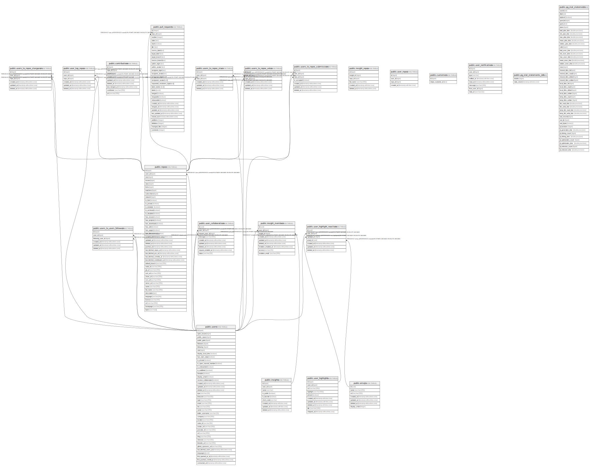

# opensauced.dev database structure

## Description

🍕 The backend for the site that recommends the hottest projects on GitHub.

## Tables

| Name                                                                      | Columns | Comment | Type       |
| ------------------------------------------------------------------------- | ------- | ------- | ---------- |
| [public.users](public.users.md)                                           | 48      |         | BASE TABLE |
| [public.repos](public.repos.md)                                           | 45      |         | BASE TABLE |
| [public.contributions](public.contributions.md)                           | 9       |         | BASE TABLE |
| [public.users_to_repos_stars](public.users_to_repos_stars.md)             | 6       |         | BASE TABLE |
| [public.users_to_repos_votes](public.users_to_repos_votes.md)             | 6       |         | BASE TABLE |
| [public.users_to_repos_submissions](public.users_to_repos_submissions.md) | 7       |         | BASE TABLE |
| [public.users_to_repos_stargazers](public.users_to_repos_stargazers.md)   | 6       |         | BASE TABLE |
| [public.insights](public.insights.md)                                     | 9       |         | BASE TABLE |
| [public.insight_repos](public.insight_repos.md)                           | 6       |         | BASE TABLE |
| [public.user_repos](public.user_repos.md)                                 | 4       |         | BASE TABLE |
| [public.customers](public.customers.md)                                   | 2       |         | BASE TABLE |
| [public.user_highlights](public.user_highlights.md)                       | 13      |         | BASE TABLE |
| [public.user_notifications](public.user_notifications.md)                 | 8       |         | BASE TABLE |
| [public.users_to_users_followers](public.users_to_users_followers.md)     | 6       |         | BASE TABLE |
| [public.insight_members](public.insight_members.md)                       | 9       |         | BASE TABLE |
| [public.emojis](public.emojis.md)                                         | 7       |         | BASE TABLE |
| [public.user_highlight_reactions](public.user_highlight_reactions.md)     | 7       |         | BASE TABLE |
| [public.user_top_repos](public.user_top_repos.md)                         | 6       |         | BASE TABLE |
| [public.pg_stat_statements_info](public.pg_stat_statements_info.md)       | 2       |         | VIEW       |
| [public.pg_stat_statements](public.pg_stat_statements.md)                 | 43      |         | VIEW       |
| [public.user_collaborations](public.user_collaborations.md)               | 10      |         | BASE TABLE |
| [public.endorsements](public.endorsements.md)                             | 8       |         | BASE TABLE |
| [public.baked_repos](public.baked_repos.md)                               | 3       |         | BASE TABLE |
| [public.commit_authors](public.commit_authors.md)                         | 2       |         | BASE TABLE |
| [public.commits](public.commits.md)                                       | 5       |         | BASE TABLE |
| [public.maintainers](public.maintainers.md)                               | 1       |         | BASE TABLE |
| [public.user_organizations](public.user_organizations.md)                 | 5       |         | BASE TABLE |
| [public.user_lists](public.user_lists.md)                                 | 8       |         | BASE TABLE |
| [public.user_list_contributors](public.user_list_contributors.md)         | 6       |         | BASE TABLE |
| [public.coupons](public.coupons.md)                                       | 3       |         | BASE TABLE |
| [public.workspaces](public.workspaces.md)                                 | 8       |         | BASE TABLE |
| [public.workspace_members](public.workspace_members.md)                   | 7       |         | BASE TABLE |
| [public.workspace_orgs](public.workspace_orgs.md)                         | 6       |         | BASE TABLE |
| [public.workspace_repos](public.workspace_repos.md)                       | 6       |         | BASE TABLE |
| [public.workspace_insights](public.workspace_insights.md)                 | 6       |         | BASE TABLE |
| [public.workspace_contributors](public.workspace_contributors.md)         | 6       |         | BASE TABLE |
| [public.workspace_user_lists](public.workspace_user_lists.md)             | 6       |         | BASE TABLE |

## Relations

---

> Generated by [tbls](https://github.com/k1LoW/tbls)
