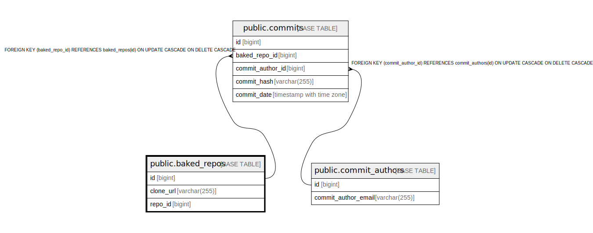

# public.baked_repos

## Description

## Columns

| Name      | Type         | Default | Nullable | Children                            | Parents | Comment |
| --------- | ------------ | ------- | -------- | ----------------------------------- | ------- | ------- |
| id        | bigint       |         | false    | [public.commits](public.commits.md) |         |         |
| clone_url | varchar(255) |         | false    |                                     |         |         |
| repo_id   | bigint       |         | true     |                                     |         |         |

## Constraints

| Name             | Type        | Definition       |
| ---------------- | ----------- | ---------------- |
| baked_repos_pkey | PRIMARY KEY | PRIMARY KEY (id) |

## Indexes

| Name                      | Definition                                                                           |
| ------------------------- | ------------------------------------------------------------------------------------ |
| baked_repos_pkey          | CREATE UNIQUE INDEX baked_repos_pkey ON public.baked_repos USING btree (id)          |
| baked_repos_idx_clone_url | CREATE INDEX baked_repos_idx_clone_url ON public.baked_repos USING btree (clone_url) |

## Relations

---

> Generated by [tbls](https://github.com/k1LoW/tbls)
