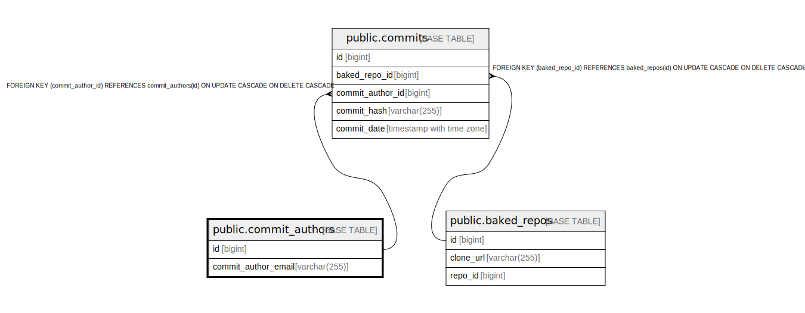

# public.commit_authors

## Description

## Columns

| Name                | Type         | Default | Nullable | Children                            | Parents | Comment |
| ------------------- | ------------ | ------- | -------- | ----------------------------------- | ------- | ------- |
| id                  | bigint       |         | false    | [public.commits](public.commits.md) |         |         |
| commit_author_email | varchar(255) |         | false    |                                     |         |         |

## Constraints

| Name                        | Type        | Definition                   |
| --------------------------- | ----------- | ---------------------------- |
| commit_authors_pkey         | PRIMARY KEY | PRIMARY KEY (id)             |
| unique_commit_author_emails | UNIQUE      | UNIQUE (commit_author_email) |

## Indexes

| Name                                   | Definition                                                                                                     |
| -------------------------------------- | -------------------------------------------------------------------------------------------------------------- |
| commit_authors_pkey                    | CREATE UNIQUE INDEX commit_authors_pkey ON public.commit_authors USING btree (id)                              |
| commit_authors_idx_commit_author_email | CREATE INDEX commit_authors_idx_commit_author_email ON public.commit_authors USING btree (commit_author_email) |
| unique_commit_author_emails            | CREATE UNIQUE INDEX unique_commit_author_emails ON public.commit_authors USING btree (commit_author_email)     |

## Relations

---

> Generated by [tbls](https://github.com/k1LoW/tbls)
