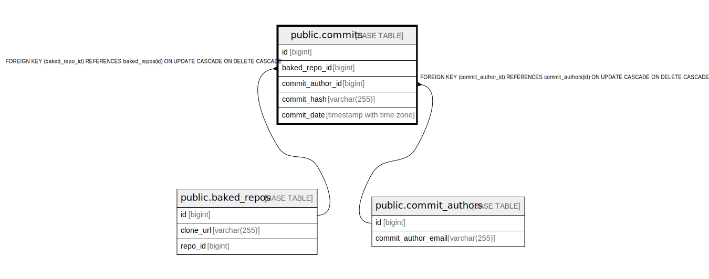

# public.commits

## Description

## Columns

| Name             | Type                     | Default | Nullable | Children | Parents                                           | Comment |
| ---------------- | ------------------------ | ------- | -------- | -------- | ------------------------------------------------- | ------- |
| id               | bigint                   |         | false    |          |                                                   |         |
| baked_repo_id    | bigint                   |         | false    |          | [public.baked_repos](public.baked_repos.md)       |         |
| commit_author_id | bigint                   |         | false    |          | [public.commit_authors](public.commit_authors.md) |         |
| commit_hash      | varchar(255)             |         | false    |          |                                                   |         |
| commit_date      | timestamp with time zone | now()   | false    |          |                                                   |         |

## Constraints

| Name                          | Type        | Definition                                                                                       |
| ----------------------------- | ----------- | ------------------------------------------------------------------------------------------------ |
| commits_baked_repo_id_fkey    | FOREIGN KEY | FOREIGN KEY (baked_repo_id) REFERENCES baked_repos(id) ON UPDATE CASCADE ON DELETE CASCADE       |
| commits_commit_author_id_fkey | FOREIGN KEY | FOREIGN KEY (commit_author_id) REFERENCES commit_authors(id) ON UPDATE CASCADE ON DELETE CASCADE |
| commits_pkey                  | PRIMARY KEY | PRIMARY KEY (id)                                                                                 |

## Indexes

| Name            | Definition                                                               |
| --------------- | ------------------------------------------------------------------------ |
| commits_pkey    | CREATE UNIQUE INDEX commits_pkey ON public.commits USING btree (id)      |
| commit_idx_hash | CREATE INDEX commit_idx_hash ON public.commits USING btree (commit_hash) |
| commit_idx_date | CREATE INDEX commit_idx_date ON public.commits USING btree (commit_date) |

## Relations

---

> Generated by [tbls](https://github.com/k1LoW/tbls)
