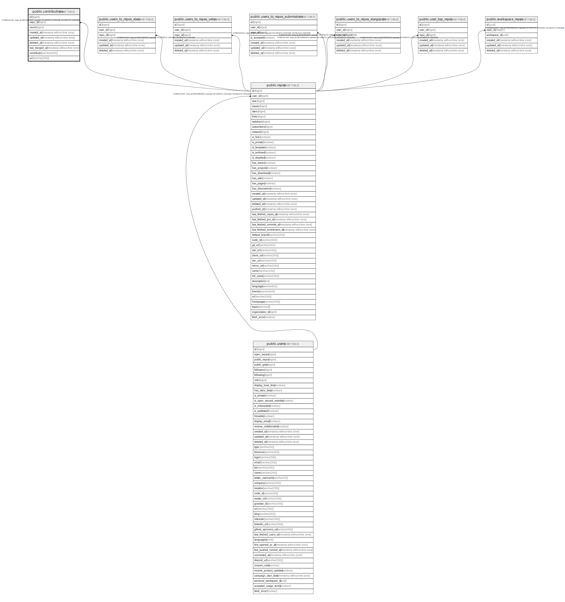

# public.contributions

## Description

## Columns

| Name           | Type                        | Default | Nullable | Children | Parents                         | Comment |
| -------------- | --------------------------- | ------- | -------- | -------- | ------------------------------- | ------- |
| id             | bigint                      |         | false    |          |                                 |         |
| repo_id        | bigint                      |         | false    |          | [public.repos](public.repos.md) |         |
| count          | bigint                      | 0       | false    |          |                                 |         |
| created_at     | timestamp without time zone | now()   | false    |          |                                 |         |
| updated_at     | timestamp without time zone | now()   | false    |          |                                 |         |
| deleted_at     | timestamp without time zone |         | true     |          |                                 |         |
| last_merged_at | timestamp without time zone |         | false    |          |                                 |         |
| contributor    | varchar(255)                |         | true     |          |                                 |         |
| url            | varchar(255)                |         | true     |          |                                 |         |

## Constraints

| Name                       | Type        | Definition                                                                     |
| -------------------------- | ----------- | ------------------------------------------------------------------------------ |
| contributions_repo_id_fkey | FOREIGN KEY | FOREIGN KEY (repo_id) REFERENCES repos(id) ON UPDATE CASCADE ON DELETE CASCADE |
| contributions_pkey         | PRIMARY KEY | PRIMARY KEY (id)                                                               |
| contributions_hash         | UNIQUE      | UNIQUE (contributor, repo_id)                                                  |

## Indexes

| Name               | Definition                                                                                        |
| ------------------ | ------------------------------------------------------------------------------------------------- |
| contributions_pkey | CREATE UNIQUE INDEX contributions_pkey ON public.contributions USING btree (id)                   |
| contributions_hash | CREATE UNIQUE INDEX contributions_hash ON public.contributions USING btree (contributor, repo_id) |

## Relations

---

> Generated by [tbls](https://github.com/k1LoW/tbls)
