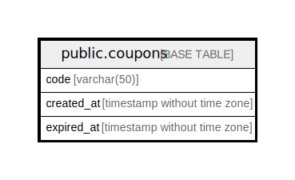

# public.coupons

## Description

## Columns

| Name       | Type                        | Default | Nullable | Children | Parents | Comment |
| ---------- | --------------------------- | ------- | -------- | -------- | ------- | ------- |
| code       | varchar(50)                 |         | false    |          |         |         |
| created_at | timestamp without time zone | now()   | false    |          |         |         |
| expired_at | timestamp without time zone |         | true     |          |         |         |

## Constraints

| Name         | Type        | Definition         |
| ------------ | ----------- | ------------------ |
| coupons_pkey | PRIMARY KEY | PRIMARY KEY (code) |

## Indexes

| Name                   | Definition                                                                     |
| ---------------------- | ------------------------------------------------------------------------------ |
| coupons_pkey           | CREATE UNIQUE INDEX coupons_pkey ON public.coupons USING btree (code)          |
| coupons_idx_created_at | CREATE INDEX coupons_idx_created_at ON public.coupons USING btree (created_at) |
| coupons_idx_expired_at | CREATE INDEX coupons_idx_expired_at ON public.coupons USING btree (expired_at) |

## Relations

---

> Generated by [tbls](https://github.com/k1LoW/tbls)
