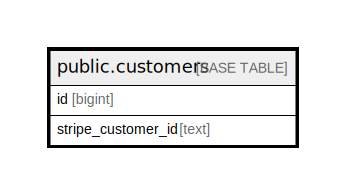

# public.customers

## Description

## Columns

| Name               | Type   | Default | Nullable | Children | Parents | Comment |
| ------------------ | ------ | ------- | -------- | -------- | ------- | ------- |
| id                 | bigint |         | false    |          |         |         |
| stripe_customer_id | text   |         | true     |          |         |         |

## Constraints

| Name           | Type        | Definition       |
| -------------- | ----------- | ---------------- |
| customers_pkey | PRIMARY KEY | PRIMARY KEY (id) |

## Indexes

| Name           | Definition                                                              |
| -------------- | ----------------------------------------------------------------------- |
| customers_pkey | CREATE UNIQUE INDEX customers_pkey ON public.customers USING btree (id) |

## Relations

---

> Generated by [tbls](https://github.com/k1LoW/tbls)
