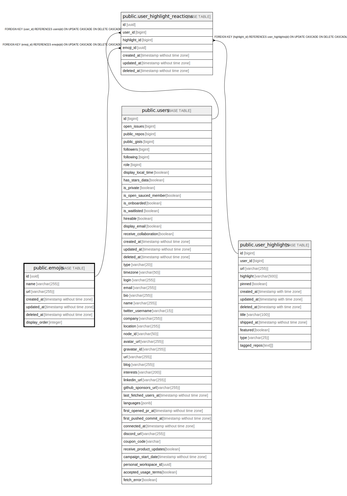

# public.emojis

## Description

## Columns

| Name          | Type                        | Default               | Nullable | Children                                                              | Parents | Comment |
| ------------- | --------------------------- | --------------------- | -------- | --------------------------------------------------------------------- | ------- | ------- |
| id            | uuid                        | uuid_generate_v4()    | false    | [public.user_highlight_reactions](public.user_highlight_reactions.md) |         |         |
| name          | varchar(255)                | ''::character varying | false    |                                                                       |         |         |
| url           | varchar(255)                | ''::character varying | false    |                                                                       |         |         |
| created_at    | timestamp without time zone | now()                 | false    |                                                                       |         |         |
| updated_at    | timestamp without time zone | now()                 | false    |                                                                       |         |         |
| deleted_at    | timestamp without time zone |                       | true     |                                                                       |         |         |
| display_order | integer                     | 100                   | false    |                                                                       |         |         |

## Constraints

| Name        | Type        | Definition       |
| ----------- | ----------- | ---------------- |
| emojis_pkey | PRIMARY KEY | PRIMARY KEY (id) |

## Indexes

| Name        | Definition                                                        |
| ----------- | ----------------------------------------------------------------- |
| emojis_pkey | CREATE UNIQUE INDEX emojis_pkey ON public.emojis USING btree (id) |

## Relations

---

> Generated by [tbls](https://github.com/k1LoW/tbls)
