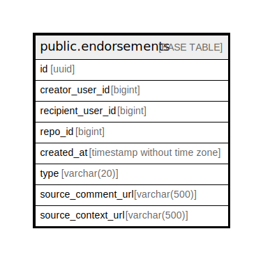

# public.endorsements

## Description

## Columns

| Name               | Type                        | Default            | Nullable | Children | Parents | Comment |
| ------------------ | --------------------------- | ------------------ | -------- | -------- | ------- | ------- |
| id                 | uuid                        | uuid_generate_v4() | false    |          |         |         |
| creator_user_id    | bigint                      |                    | false    |          |         |         |
| recipient_user_id  | bigint                      |                    | false    |          |         |         |
| repo_id            | bigint                      |                    | false    |          |         |         |
| created_at         | timestamp without time zone | now()              | false    |          |         |         |
| type               | varchar(20)                 |                    | false    |          |         |         |
| source_comment_url | varchar(500)                |                    | true     |          |         |         |
| source_context_url | varchar(500)                |                    | false    |          |         |         |

## Constraints

| Name              | Type        | Definition       |
| ----------------- | ----------- | ---------------- |
| endorsements_pkey | PRIMARY KEY | PRIMARY KEY (id) |

## Indexes

| Name                               | Definition                                                                                             |
| ---------------------------------- | ------------------------------------------------------------------------------------------------------ |
| endorsements_pkey                  | CREATE UNIQUE INDEX endorsements_pkey ON public.endorsements USING btree (id)                          |
| endorsements_idx_creator_user_id   | CREATE INDEX endorsements_idx_creator_user_id ON public.endorsements USING btree (creator_user_id)     |
| endorsements_idx_recipient_user_id | CREATE INDEX endorsements_idx_recipient_user_id ON public.endorsements USING btree (recipient_user_id) |
| endorsements_idx_repo_id           | CREATE INDEX endorsements_idx_repo_id ON public.endorsements USING btree (repo_id)                     |
| endorsements_idx_created_at        | CREATE INDEX endorsements_idx_created_at ON public.endorsements USING btree (created_at)               |

## Relations

---

> Generated by [tbls](https://github.com/k1LoW/tbls)
