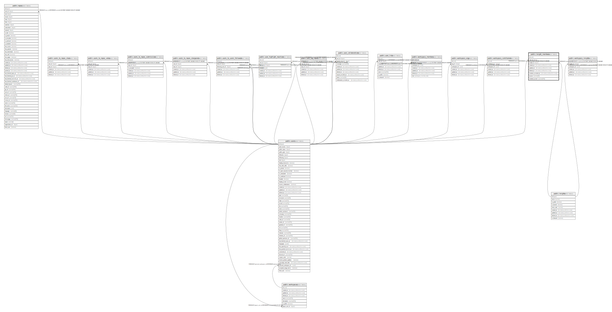

# public.insight_members

## Description

## Columns

| Name                  | Type                        | Default                      | Nullable | Children | Parents                               | Comment |
| --------------------- | --------------------------- | ---------------------------- | -------- | -------- | ------------------------------------- | ------- |
| id                    | uuid                        | uuid_generate_v4()           | false    |          |                                       |         |
| user_id               | bigint                      |                              | true     |          | [public.users](public.users.md)       |         |
| insight_id            | bigint                      |                              | false    |          | [public.insights](public.insights.md) |         |
| created_at            | timestamp without time zone | now()                        | false    |          |                                       |         |
| updated_at            | timestamp without time zone | now()                        | false    |          |                                       |         |
| deleted_at            | timestamp without time zone |                              | true     |          |                                       |         |
| invitation_emailed_at | timestamp without time zone |                              | true     |          |                                       |         |
| access                | varchar(20)                 | 'pending'::character varying | false    |          |                                       |         |
| invitation_email      | varchar(255)                | ''::character varying        | false    |          |                                       |         |

## Constraints

| Name                            | Type        | Definition                                                                           |
| ------------------------------- | ----------- | ------------------------------------------------------------------------------------ |
| insight_members_user_id_fkey    | FOREIGN KEY | FOREIGN KEY (user_id) REFERENCES users(id) ON UPDATE CASCADE ON DELETE CASCADE       |
| insight_members_insight_id_fkey | FOREIGN KEY | FOREIGN KEY (insight_id) REFERENCES insights(id) ON UPDATE CASCADE ON DELETE CASCADE |
| insight_team_members_pkey       | PRIMARY KEY | PRIMARY KEY (id)                                                                     |

## Indexes

| Name                      | Definition                                                                               |
| ------------------------- | ---------------------------------------------------------------------------------------- |
| insight_team_members_pkey | CREATE UNIQUE INDEX insight_team_members_pkey ON public.insight_members USING btree (id) |

## Relations

---

> Generated by [tbls](https://github.com/k1LoW/tbls)
