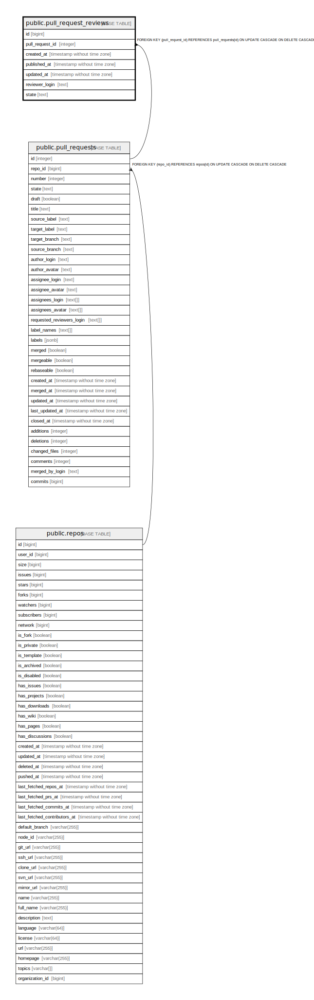

# public.pull_request_reviews

## Description

## Columns

| Name            | Type                        | Default  | Nullable | Children | Parents                                         | Comment |
| --------------- | --------------------------- | -------- | -------- | -------- | ----------------------------------------------- | ------- |
| id              | bigint                      |          | false    |          |                                                 |         |
| pull_request_id | integer                     |          | false    |          | [public.pull_requests](public.pull_requests.md) |         |
| created_at      | timestamp without time zone | now()    | false    |          |                                                 |         |
| published_at    | timestamp without time zone | now()    | false    |          |                                                 |         |
| updated_at      | timestamp without time zone | now()    | false    |          |                                                 |         |
| reviewer_login  | text                        | ''::text | true     |          |                                                 |         |
| state           | text                        | ''::text | true     |          |                                                 |         |

## Constraints

| Name                                      | Type        | Definition                                                                                     |
| ----------------------------------------- | ----------- | ---------------------------------------------------------------------------------------------- |
| pull_request_reviews_pull_request_id_fkey | FOREIGN KEY | FOREIGN KEY (pull_request_id) REFERENCES pull_requests(id) ON UPDATE CASCADE ON DELETE CASCADE |
| pull_request_reviews_pkey                 | PRIMARY KEY | PRIMARY KEY (id)                                                                               |

## Indexes

| Name                      | Definition                                                                                             |
| ------------------------- | ------------------------------------------------------------------------------------------------------ |
| pull_request_reviews_pkey | CREATE UNIQUE INDEX pull_request_reviews_pkey ON public.pull_request_reviews USING btree (id)          |
| pull_request_reviewers    | CREATE INDEX pull_request_reviewers ON public.pull_request_reviews USING btree (lower(reviewer_login)) |

## Relations

---

> Generated by [tbls](https://github.com/k1LoW/tbls)
