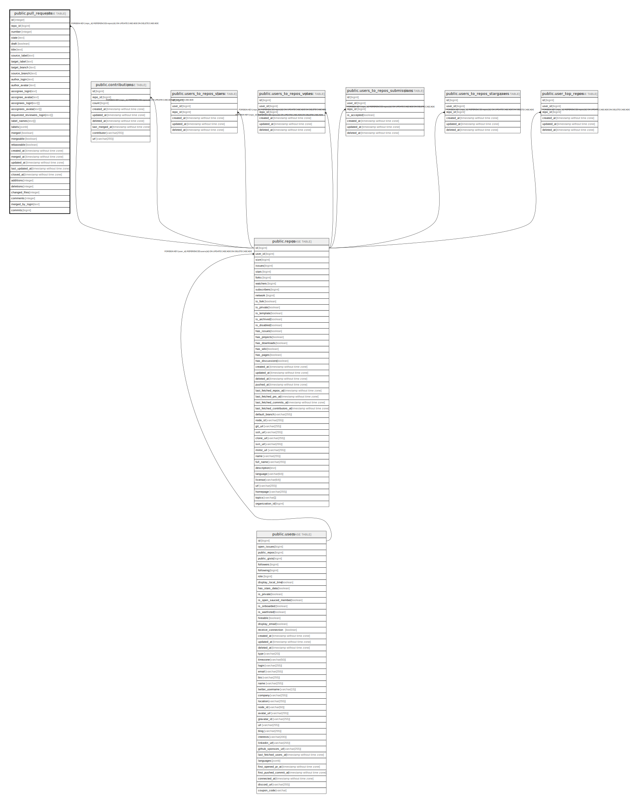

# public.pull_requests

## Description

## Columns

| Name                      | Type                        | Default  | Nullable | Children | Parents                         | Comment |
| ------------------------- | --------------------------- | -------- | -------- | -------- | ------------------------------- | ------- |
| id                        | integer                     |          | false    |          |                                 |         |
| repo_id                   | bigint                      |          | false    |          | [public.repos](public.repos.md) |         |
| number                    | integer                     |          | true     |          |                                 |         |
| state                     | text                        |          | true     |          |                                 |         |
| draft                     | boolean                     | false    | true     |          |                                 |         |
| title                     | text                        |          | false    |          |                                 |         |
| source_label              | text                        | ''::text | true     |          |                                 |         |
| target_label              | text                        | ''::text | true     |          |                                 |         |
| target_branch             | text                        |          | true     |          |                                 |         |
| source_branch             | text                        |          | true     |          |                                 |         |
| author_login              | text                        |          | true     |          |                                 |         |
| author_avatar             | text                        |          | true     |          |                                 |         |
| assignee_login            | text                        | ''::text | true     |          |                                 |         |
| assignee_avatar           | text                        | ''::text | true     |          |                                 |         |
| assignees_login           | text[]                      |          | true     |          |                                 |         |
| assignees_avatar          | text[]                      |          | true     |          |                                 |         |
| requested_reviewers_login | text[]                      |          | true     |          |                                 |         |
| label_names               | text[]                      |          | true     |          |                                 |         |
| labels                    | jsonb                       |          | true     |          |                                 |         |
| merged                    | boolean                     | false    | true     |          |                                 |         |
| mergeable                 | boolean                     | false    | true     |          |                                 |         |
| rebaseable                | boolean                     | false    | true     |          |                                 |         |
| created_at                | timestamp without time zone | now()    | false    |          |                                 |         |
| merged_at                 | timestamp without time zone |          | true     |          |                                 |         |
| updated_at                | timestamp without time zone | now()    | false    |          |                                 |         |
| last_updated_at           | timestamp without time zone | now()    | false    |          |                                 |         |
| closed_at                 | timestamp without time zone |          | true     |          |                                 |         |
| additions                 | integer                     | 0        | true     |          |                                 |         |
| deletions                 | integer                     | 0        | true     |          |                                 |         |
| changed_files             | integer                     | 0        | true     |          |                                 |         |
| comments                  | integer                     | 0        | true     |          |                                 |         |
| merged_by_login           | text                        | ''::text | true     |          |                                 |         |

## Constraints

| Name                      | Type        | Definition                                                                     |
| ------------------------- | ----------- | ------------------------------------------------------------------------------ |
| pull_requests_repos_id_fk | FOREIGN KEY | FOREIGN KEY (repo_id) REFERENCES repos(id) ON UPDATE CASCADE ON DELETE CASCADE |
| pull_requests_pkey        | PRIMARY KEY | PRIMARY KEY (id)                                                               |

## Indexes

| Name                              | Definition                                                                                           |
| --------------------------------- | ---------------------------------------------------------------------------------------------------- |
| pull_requests_pkey                | CREATE UNIQUE INDEX pull_requests_pkey ON public.pull_requests USING btree (id)                      |
| pull_requests_idx_repo_id         | CREATE INDEX pull_requests_idx_repo_id ON public.pull_requests USING btree (repo_id)                 |
| pull_requests_idx_updated_at      | CREATE INDEX pull_requests_idx_updated_at ON public.pull_requests USING btree (updated_at)           |
| pull_requests_idx_state           | CREATE INDEX pull_requests_idx_state ON public.pull_requests USING btree (state)                     |
| pull_requests_idx_label_names     | CREATE INDEX pull_requests_idx_label_names ON public.pull_requests USING btree (label_names)         |
| pull_requests_idx_author_login    | CREATE INDEX pull_requests_idx_author_login ON public.pull_requests USING btree (author_login)       |
| pull_requests_idx_merged_by_login | CREATE INDEX pull_requests_idx_merged_by_login ON public.pull_requests USING btree (merged_by_login) |

## Relations

---

> Generated by [tbls](https://github.com/k1LoW/tbls)
