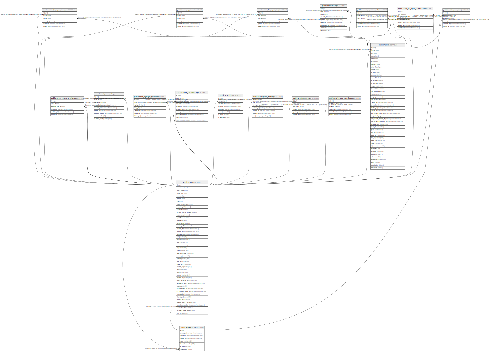

# public.repos

## Description

## Columns

| Name                         | Type                        | Default                             | Nullable | Children                                                                                                                                                                                                                                                                                                                                                                                                                            | Parents                         | Comment |
| ---------------------------- | --------------------------- | ----------------------------------- | -------- | ----------------------------------------------------------------------------------------------------------------------------------------------------------------------------------------------------------------------------------------------------------------------------------------------------------------------------------------------------------------------------------------------------------------------------------- | ------------------------------- | ------- |
| id                           | bigint                      |                                     | false    | [public.contributions](public.contributions.md) [public.users_to_repos_stars](public.users_to_repos_stars.md) [public.users_to_repos_votes](public.users_to_repos_votes.md) [public.users_to_repos_submissions](public.users_to_repos_submissions.md) [public.users_to_repos_stargazers](public.users_to_repos_stargazers.md) [public.user_top_repos](public.user_top_repos.md) [public.workspace_repos](public.workspace_repos.md) |                                 |         |
| user_id                      | bigint                      |                                     | false    |                                                                                                                                                                                                                                                                                                                                                                                                                                     | [public.users](public.users.md) |         |
| size                         | bigint                      | 0                                   | false    |                                                                                                                                                                                                                                                                                                                                                                                                                                     |                                 |         |
| issues                       | bigint                      | 0                                   | false    |                                                                                                                                                                                                                                                                                                                                                                                                                                     |                                 |         |
| stars                        | bigint                      | 0                                   | false    |                                                                                                                                                                                                                                                                                                                                                                                                                                     |                                 |         |
| forks                        | bigint                      | 0                                   | false    |                                                                                                                                                                                                                                                                                                                                                                                                                                     |                                 |         |
| watchers                     | bigint                      | 0                                   | false    |                                                                                                                                                                                                                                                                                                                                                                                                                                     |                                 |         |
| subscribers                  | bigint                      | 0                                   | false    |                                                                                                                                                                                                                                                                                                                                                                                                                                     |                                 |         |
| network                      | bigint                      | 0                                   | false    |                                                                                                                                                                                                                                                                                                                                                                                                                                     |                                 |         |
| is_fork                      | boolean                     | false                               | false    |                                                                                                                                                                                                                                                                                                                                                                                                                                     |                                 |         |
| is_private                   | boolean                     | false                               | false    |                                                                                                                                                                                                                                                                                                                                                                                                                                     |                                 |         |
| is_template                  | boolean                     | false                               | false    |                                                                                                                                                                                                                                                                                                                                                                                                                                     |                                 |         |
| is_archived                  | boolean                     | false                               | false    |                                                                                                                                                                                                                                                                                                                                                                                                                                     |                                 |         |
| is_disabled                  | boolean                     | false                               | false    |                                                                                                                                                                                                                                                                                                                                                                                                                                     |                                 |         |
| has_issues                   | boolean                     | true                                | false    |                                                                                                                                                                                                                                                                                                                                                                                                                                     |                                 |         |
| has_projects                 | boolean                     | true                                | false    |                                                                                                                                                                                                                                                                                                                                                                                                                                     |                                 |         |
| has_downloads                | boolean                     | true                                | false    |                                                                                                                                                                                                                                                                                                                                                                                                                                     |                                 |         |
| has_wiki                     | boolean                     | true                                | false    |                                                                                                                                                                                                                                                                                                                                                                                                                                     |                                 |         |
| has_pages                    | boolean                     | true                                | false    |                                                                                                                                                                                                                                                                                                                                                                                                                                     |                                 |         |
| has_discussions              | boolean                     | true                                | false    |                                                                                                                                                                                                                                                                                                                                                                                                                                     |                                 |         |
| created_at                   | timestamp without time zone | now()                               | false    |                                                                                                                                                                                                                                                                                                                                                                                                                                     |                                 |         |
| updated_at                   | timestamp without time zone | now()                               | false    |                                                                                                                                                                                                                                                                                                                                                                                                                                     |                                 |         |
| deleted_at                   | timestamp without time zone |                                     | true     |                                                                                                                                                                                                                                                                                                                                                                                                                                     |                                 |         |
| pushed_at                    | timestamp without time zone | now()                               | true     |                                                                                                                                                                                                                                                                                                                                                                                                                                     |                                 |         |
| last_fetched_repos_at        | timestamp without time zone | to_timestamp((0)::double precision) | true     |                                                                                                                                                                                                                                                                                                                                                                                                                                     |                                 |         |
| last_fetched_prs_at          | timestamp without time zone | to_timestamp((0)::double precision) | true     |                                                                                                                                                                                                                                                                                                                                                                                                                                     |                                 |         |
| last_fetched_commits_at      | timestamp without time zone | to_timestamp((0)::double precision) | true     |                                                                                                                                                                                                                                                                                                                                                                                                                                     |                                 |         |
| last_fetched_contributors_at | timestamp without time zone | to_timestamp((0)::double precision) | true     |                                                                                                                                                                                                                                                                                                                                                                                                                                     |                                 |         |
| default_branch               | varchar(255)                | 'main'::character varying           | false    |                                                                                                                                                                                                                                                                                                                                                                                                                                     |                                 |         |
| node_id                      | varchar(255)                | ''::character varying               | false    |                                                                                                                                                                                                                                                                                                                                                                                                                                     |                                 |         |
| git_url                      | varchar(255)                | ''::character varying               | false    |                                                                                                                                                                                                                                                                                                                                                                                                                                     |                                 |         |
| ssh_url                      | varchar(255)                | ''::character varying               | false    |                                                                                                                                                                                                                                                                                                                                                                                                                                     |                                 |         |
| clone_url                    | varchar(255)                | ''::character varying               | false    |                                                                                                                                                                                                                                                                                                                                                                                                                                     |                                 |         |
| svn_url                      | varchar(255)                | ''::character varying               | false    |                                                                                                                                                                                                                                                                                                                                                                                                                                     |                                 |         |
| mirror_url                   | varchar(255)                | ''::character varying               | false    |                                                                                                                                                                                                                                                                                                                                                                                                                                     |                                 |         |
| name                         | varchar(255)                |                                     | true     |                                                                                                                                                                                                                                                                                                                                                                                                                                     |                                 |         |
| full_name                    | varchar(255)                |                                     | true     |                                                                                                                                                                                                                                                                                                                                                                                                                                     |                                 |         |
| description                  | text                        | ''::text                            | false    |                                                                                                                                                                                                                                                                                                                                                                                                                                     |                                 |         |
| language                     | varchar(64)                 | ''::character varying               | false    |                                                                                                                                                                                                                                                                                                                                                                                                                                     |                                 |         |
| license                      | varchar(64)                 | ''::character varying               | false    |                                                                                                                                                                                                                                                                                                                                                                                                                                     |                                 |         |
| url                          | varchar(255)                | ''::character varying               | false    |                                                                                                                                                                                                                                                                                                                                                                                                                                     |                                 |         |
| homepage                     | varchar(255)                | ''::character varying               | false    |                                                                                                                                                                                                                                                                                                                                                                                                                                     |                                 |         |
| topics                       | varchar[]                   | ARRAY[]::character varying[]        | false    |                                                                                                                                                                                                                                                                                                                                                                                                                                     |                                 |         |
| organization_id              | bigint                      |                                     | true     |                                                                                                                                                                                                                                                                                                                                                                                                                                     |                                 |         |
| fetch_error                  | boolean                     | false                               | true     |                                                                                                                                                                                                                                                                                                                                                                                                                                     |                                 |         |

## Constraints

| Name               | Type        | Definition                                                                     |
| ------------------ | ----------- | ------------------------------------------------------------------------------ |
| repos_user_id_fkey | FOREIGN KEY | FOREIGN KEY (user_id) REFERENCES users(id) ON UPDATE CASCADE ON DELETE CASCADE |
| user_stars_pkey    | PRIMARY KEY | PRIMARY KEY (id)                                                               |

## Indexes

| Name                                   | Definition                                                                                                     |
| -------------------------------------- | -------------------------------------------------------------------------------------------------------------- |
| user_stars_pkey                        | CREATE UNIQUE INDEX user_stars_pkey ON public.repos USING btree (id)                                           |
| repos_idx_size                         | CREATE INDEX repos_idx_size ON public.repos USING btree (size)                                                 |
| repos_idx_is_fork                      | CREATE INDEX repos_idx_is_fork ON public.repos USING btree (is_fork DESC)                                      |
| repos_idx_is_private                   | CREATE INDEX repos_idx_is_private ON public.repos USING btree (is_private DESC)                                |
| repos_idx_is_template                  | CREATE INDEX repos_idx_is_template ON public.repos USING btree (is_template DESC)                              |
| repos_idx_is_archived                  | CREATE INDEX repos_idx_is_archived ON public.repos USING btree (is_archived DESC)                              |
| repos_idx_is_disabled                  | CREATE INDEX repos_idx_is_disabled ON public.repos USING btree (is_disabled DESC)                              |
| repos_idx_has_issues                   | CREATE INDEX repos_idx_has_issues ON public.repos USING btree (has_issues)                                     |
| repos_idx_has_projects                 | CREATE INDEX repos_idx_has_projects ON public.repos USING btree (has_projects)                                 |
| repos_idx_has_downloads                | CREATE INDEX repos_idx_has_downloads ON public.repos USING btree (has_downloads)                               |
| repos_idx_has_wiki                     | CREATE INDEX repos_idx_has_wiki ON public.repos USING btree (has_wiki)                                         |
| repos_idx_has_pages                    | CREATE INDEX repos_idx_has_pages ON public.repos USING btree (has_pages)                                       |
| repos_idx_has_discussions              | CREATE INDEX repos_idx_has_discussions ON public.repos USING btree (has_discussions)                           |
| repos_idx_issues                       | CREATE INDEX repos_idx_issues ON public.repos USING btree (issues)                                             |
| repos_idx_stars                        | CREATE INDEX repos_idx_stars ON public.repos USING btree (stars)                                               |
| repos_idx_forks                        | CREATE INDEX repos_idx_forks ON public.repos USING btree (forks)                                               |
| repos_idx_watchers                     | CREATE INDEX repos_idx_watchers ON public.repos USING btree (watchers)                                         |
| repos_idx_subscribers                  | CREATE INDEX repos_idx_subscribers ON public.repos USING btree (subscribers)                                   |
| repos_idx_network                      | CREATE INDEX repos_idx_network ON public.repos USING btree (network)                                           |
| repos_idx_deleted_at                   | CREATE INDEX repos_idx_deleted_at ON public.repos USING btree (deleted_at)                                     |
| repos_idx_last_fetched_repos_at        | CREATE INDEX repos_idx_last_fetched_repos_at ON public.repos USING btree (last_fetched_repos_at)               |
| repos_idx_last_fetched_prs_at          | CREATE INDEX repos_idx_last_fetched_prs_at ON public.repos USING btree (last_fetched_prs_at)                   |
| repos_idx_last_fetched_commits_at      | CREATE INDEX repos_idx_last_fetched_commits_at ON public.repos USING btree (last_fetched_commits_at)           |
| repos_idx_last_fetched_contributors_at | CREATE INDEX repos_idx_last_fetched_contributors_at ON public.repos USING btree (last_fetched_contributors_at) |
| repos_idx_default_branch               | CREATE INDEX repos_idx_default_branch ON public.repos USING btree (default_branch)                             |
| repos_idx_name                         | CREATE INDEX repos_idx_name ON public.repos USING btree (name)                                                 |
| repos_idx_full_name                    | CREATE INDEX repos_idx_full_name ON public.repos USING btree (full_name)                                       |
| repos_idx_language                     | CREATE INDEX repos_idx_language ON public.repos USING btree (language)                                         |
| repos_idx_license                      | CREATE INDEX repos_idx_license ON public.repos USING btree (license)                                           |
| repos_idx_topics                       | CREATE INDEX repos_idx_topics ON public.repos USING btree (topics)                                             |
| repos_idx_updated_at                   | CREATE INDEX repos_idx_updated_at ON public.repos USING btree (updated_at DESC)                                |
| repos_idx_full_name_lower              | CREATE INDEX repos_idx_full_name_lower ON public.repos USING btree (lower((full_name)::text))                  |
| idx_repo_fetch_error                   | CREATE INDEX idx_repo_fetch_error ON public.repos USING btree (fetch_error)                                    |

## Relations

---

> Generated by [tbls](https://github.com/k1LoW/tbls)
