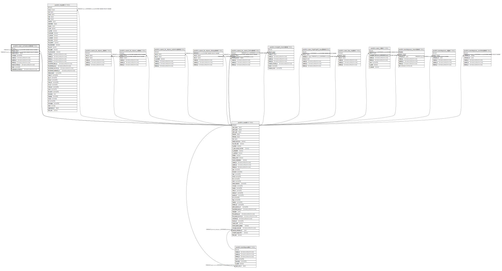

# public.user_collaborations

## Description

## Columns

| Name                     | Type                        | Default                      | Nullable | Children | Parents                         | Comment |
| ------------------------ | --------------------------- | ---------------------------- | -------- | -------- | ------------------------------- | ------- |
| id                       | uuid                        | uuid_generate_v4()           | false    |          |                                 |         |
| user_id                  | bigint                      |                              | false    |          | [public.users](public.users.md) |         |
| request_user_id          | bigint                      |                              | true     |          | [public.users](public.users.md) |         |
| message                  | varchar(500)                | ''::character varying        | false    |          |                                 |         |
| created_at               | timestamp without time zone | now()                        | false    |          |                                 |         |
| updated_at               | timestamp without time zone | now()                        | false    |          |                                 |         |
| deleted_at               | timestamp without time zone |                              | true     |          |                                 |         |
| request_emailed_at       | timestamp without time zone |                              | true     |          |                                 |         |
| status                   | varchar(20)                 | 'pending'::character varying | false    |          |                                 |         |
| collaboration_emailed_at | timestamp without time zone |                              | true     |          |                                 |         |

## Constraints

| Name                                     | Type        | Definition                                                                             |
| ---------------------------------------- | ----------- | -------------------------------------------------------------------------------------- |
| user_collaborations_request_user_id_fkey | FOREIGN KEY | FOREIGN KEY (request_user_id) REFERENCES users(id) ON UPDATE CASCADE ON DELETE CASCADE |
| user_collaborations_user_id_fkey         | FOREIGN KEY | FOREIGN KEY (user_id) REFERENCES users(id) ON UPDATE CASCADE ON DELETE CASCADE         |
| user_collaborations_pkey                 | PRIMARY KEY | PRIMARY KEY (id)                                                                       |

## Indexes

| Name                                       | Definition                                                                                                             |
| ------------------------------------------ | ---------------------------------------------------------------------------------------------------------------------- |
| user_collaborations_pkey                   | CREATE UNIQUE INDEX user_collaborations_pkey ON public.user_collaborations USING btree (id)                            |
| user_collaborations_idx_created_at         | CREATE INDEX user_collaborations_idx_created_at ON public.user_collaborations USING btree (created_at)                 |
| user_collaborations_idx_updated_at         | CREATE INDEX user_collaborations_idx_updated_at ON public.user_collaborations USING btree (updated_at)                 |
| user_collaborations_idx_deleted_at         | CREATE INDEX user_collaborations_idx_deleted_at ON public.user_collaborations USING btree (deleted_at)                 |
| user_collaborations_idx_request_emailed_at | CREATE INDEX user_collaborations_idx_request_emailed_at ON public.user_collaborations USING btree (request_emailed_at) |
| user_collaborations_idx_status             | CREATE INDEX user_collaborations_idx_status ON public.user_collaborations USING btree (status)                         |

## Relations

---

> Generated by [tbls](https://github.com/k1LoW/tbls)
