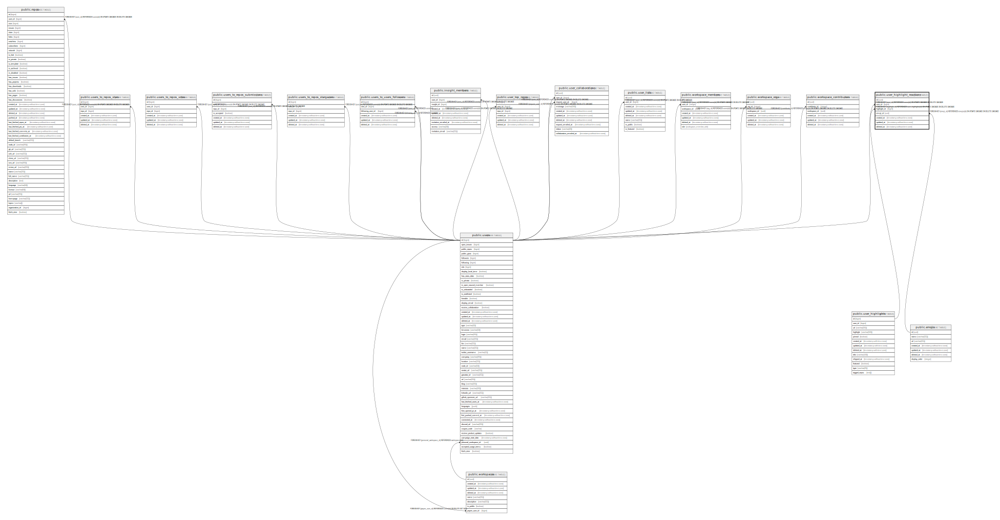

# public.user_highlight_reactions

## Description

## Columns

| Name         | Type                        | Default            | Nullable | Children | Parents                                             | Comment |
| ------------ | --------------------------- | ------------------ | -------- | -------- | --------------------------------------------------- | ------- |
| id           | uuid                        | uuid_generate_v4() | false    |          |                                                     |         |
| user_id      | bigint                      |                    | false    |          | [public.users](public.users.md)                     |         |
| highlight_id | bigint                      |                    | false    |          | [public.user_highlights](public.user_highlights.md) |         |
| emoji_id     | uuid                        |                    | false    |          | [public.emojis](public.emojis.md)                   |         |
| created_at   | timestamp without time zone | now()              | false    |          |                                                     |         |
| updated_at   | timestamp without time zone | now()              | false    |          |                                                     |         |
| deleted_at   | timestamp without time zone |                    | true     |          |                                                     |         |

## Constraints

| Name                                       | Type        | Definition                                                                                    |
| ------------------------------------------ | ----------- | --------------------------------------------------------------------------------------------- |
| user_highlight_reactions_user_id_fkey      | FOREIGN KEY | FOREIGN KEY (user_id) REFERENCES users(id) ON UPDATE CASCADE ON DELETE CASCADE                |
| user_highlight_reactions_highlight_id_fkey | FOREIGN KEY | FOREIGN KEY (highlight_id) REFERENCES user_highlights(id) ON UPDATE CASCADE ON DELETE CASCADE |
| user_highlight_reactions_emoji_id_fkey     | FOREIGN KEY | FOREIGN KEY (emoji_id) REFERENCES emojis(id) ON UPDATE CASCADE ON DELETE CASCADE              |
| highlight_reactions_pkey                   | PRIMARY KEY | PRIMARY KEY (id)                                                                              |
| highlight_reactions_hash                   | UNIQUE      | UNIQUE (user_id, highlight_id, emoji_id)                                                      |

## Indexes

| Name                     | Definition                                                                                                                    |
| ------------------------ | ----------------------------------------------------------------------------------------------------------------------------- |
| highlight_reactions_pkey | CREATE UNIQUE INDEX highlight_reactions_pkey ON public.user_highlight_reactions USING btree (id)                              |
| highlight_reactions_hash | CREATE UNIQUE INDEX highlight_reactions_hash ON public.user_highlight_reactions USING btree (user_id, highlight_id, emoji_id) |

## Relations

---

> Generated by [tbls](https://github.com/k1LoW/tbls)
