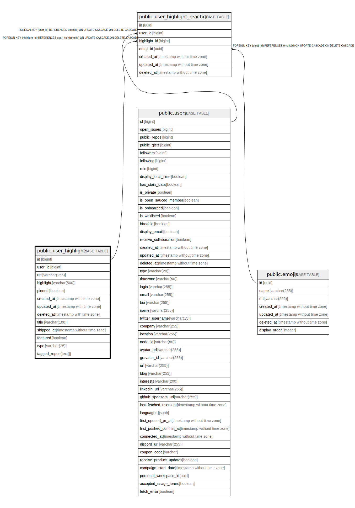

# public.user_highlights

## Description

## Columns

| Name       | Type                     | Default               | Nullable | Children | Parents | Comment |
| ---------- | ------------------------ | --------------------- | -------- | -------- | ------- | ------- |
| id         | bigint                   |                       | false    |          |         |         |
| user_id    | bigint                   |                       | false    |          |         |         |
| url        | varchar(255)             |                       | true     |          |         |         |
| highlight  | varchar(500)             |                       | false    |          |         |         |
| pinned     | boolean                  | false                 | false    |          |         |         |
| created_at | timestamp with time zone | now()                 | false    |          |         |         |
| updated_at | timestamp with time zone | now()                 | false    |          |         |         |
| deleted_at | timestamp with time zone |                       | true     |          |         |         |
| title      | varchar(100)             |                       | true     |          |         |         |
| full_name  | varchar(100)             | ''::character varying | false    |          |         |         |

## Constraints

| Name                 | Type        | Definition       |
| -------------------- | ----------- | ---------------- |
| user_highlights_pkey | PRIMARY KEY | PRIMARY KEY (id) |

## Indexes

| Name                 | Definition                                                                          |
| -------------------- | ----------------------------------------------------------------------------------- |
| user_highlights_pkey | CREATE UNIQUE INDEX user_highlights_pkey ON public.user_highlights USING btree (id) |

## Relations

---

> Generated by [tbls](https://github.com/k1LoW/tbls)
