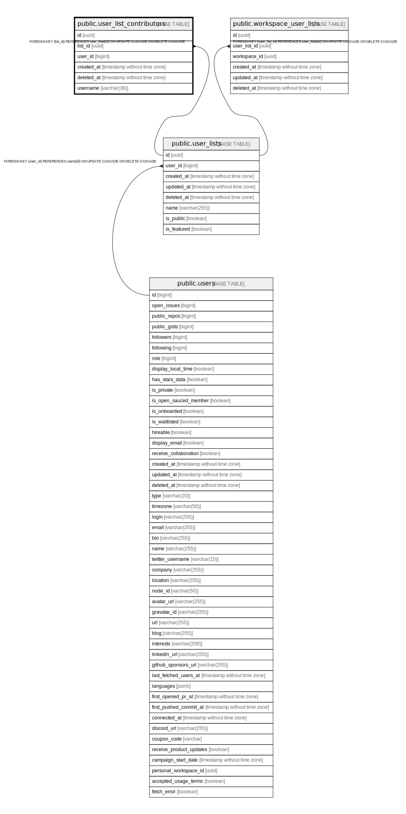

# public.user_list_contributors

## Description

## Columns

| Name       | Type                        | Default               | Nullable | Children | Parents                                   | Comment |
| ---------- | --------------------------- | --------------------- | -------- | -------- | ----------------------------------------- | ------- |
| id         | uuid                        | uuid_generate_v4()    | false    |          |                                           |         |
| list_id    | uuid                        |                       | false    |          | [public.user_lists](public.user_lists.md) |         |
| user_id    | bigint                      |                       | false    |          |                                           |         |
| created_at | timestamp without time zone | now()                 | false    |          |                                           |         |
| deleted_at | timestamp without time zone |                       | true     |          |                                           |         |
| username   | varchar(36)                 | ''::character varying | true     |          |                                           |         |

## Constraints

| Name                                | Type        | Definition                                                                          |
| ----------------------------------- | ----------- | ----------------------------------------------------------------------------------- |
| user_list_contributors_list_id_fkey | FOREIGN KEY | FOREIGN KEY (list_id) REFERENCES user_lists(id) ON UPDATE CASCADE ON DELETE CASCADE |
| user_list_contributors_pkey         | PRIMARY KEY | PRIMARY KEY (id)                                                                    |

## Indexes

| Name                                  | Definition                                                                                                   |
| ------------------------------------- | ------------------------------------------------------------------------------------------------------------ |
| user_list_contributors_pkey           | CREATE UNIQUE INDEX user_list_contributors_pkey ON public.user_list_contributors USING btree (id)            |
| user_list_contributors_idx_list_id    | CREATE INDEX user_list_contributors_idx_list_id ON public.user_list_contributors USING btree (list_id)       |
| user_list_contributors_idx_user_id    | CREATE INDEX user_list_contributors_idx_user_id ON public.user_list_contributors USING btree (user_id)       |
| user_list_contributors_idx_created_at | CREATE INDEX user_list_contributors_idx_created_at ON public.user_list_contributors USING btree (created_at) |
| user_list_contributors_idx_deleted_at | CREATE INDEX user_list_contributors_idx_deleted_at ON public.user_list_contributors USING btree (deleted_at) |

## Relations

---

> Generated by [tbls](https://github.com/k1LoW/tbls)
