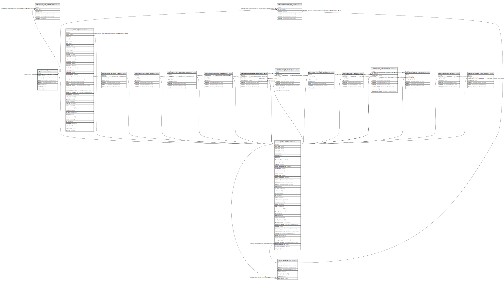

# public.user_lists

## Description

## Columns

| Name       | Type                        | Default            | Nullable | Children                                                          | Parents                         | Comment |
| ---------- | --------------------------- | ------------------ | -------- | ----------------------------------------------------------------- | ------------------------------- | ------- |
| id         | uuid                        | uuid_generate_v4() | false    | [public.user_list_contributors](public.user_list_contributors.md) |                                 |         |
| user_id    | bigint                      |                    | false    |                                                                   | [public.users](public.users.md) |         |
| created_at | timestamp without time zone | now()              | false    |                                                                   |                                 |         |
| updated_at | timestamp without time zone | now()              | false    |                                                                   |                                 |         |
| deleted_at | timestamp without time zone |                    | true     |                                                                   |                                 |         |
| name       | varchar(255)                |                    | false    |                                                                   |                                 |         |
| is_public  | boolean                     | false              | false    |                                                                   |                                 |         |

## Constraints

| Name                    | Type        | Definition                                                                     |
| ----------------------- | ----------- | ------------------------------------------------------------------------------ |
| user_lists_user_id_fkey | FOREIGN KEY | FOREIGN KEY (user_id) REFERENCES users(id) ON UPDATE CASCADE ON DELETE CASCADE |
| user_lists_pkey         | PRIMARY KEY | PRIMARY KEY (id)                                                               |

## Indexes

| Name                      | Definition                                                                           |
| ------------------------- | ------------------------------------------------------------------------------------ |
| user_lists_pkey           | CREATE UNIQUE INDEX user_lists_pkey ON public.user_lists USING btree (id)            |
| user_lists_idx_is_public  | CREATE INDEX user_lists_idx_is_public ON public.user_lists USING btree (is_public)   |
| user_lists_idx_created_at | CREATE INDEX user_lists_idx_created_at ON public.user_lists USING btree (created_at) |
| user_lists_idx_updated_at | CREATE INDEX user_lists_idx_updated_at ON public.user_lists USING btree (updated_at) |
| user_lists_idx_deleted_at | CREATE INDEX user_lists_idx_deleted_at ON public.user_lists USING btree (deleted_at) |

## Relations

---

> Generated by [tbls](https://github.com/k1LoW/tbls)
