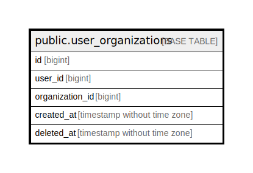

# public.user_organizations

## Description

## Columns

| Name            | Type                        | Default | Nullable | Children | Parents | Comment |
| --------------- | --------------------------- | ------- | -------- | -------- | ------- | ------- |
| id              | bigint                      |         | false    |          |         |         |
| user_id         | bigint                      |         | false    |          |         |         |
| organization_id | bigint                      |         | false    |          |         |         |
| created_at      | timestamp without time zone | now()   | true     |          |         |         |
| deleted_at      | timestamp without time zone |         | true     |          |         |         |

## Constraints

| Name                    | Type        | Definition       |
| ----------------------- | ----------- | ---------------- |
| user_organizations_pkey | PRIMARY KEY | PRIMARY KEY (id) |

## Indexes

| Name                                   | Definition                                                                                                     |
| -------------------------------------- | -------------------------------------------------------------------------------------------------------------- |
| user_organizations_pkey                | CREATE UNIQUE INDEX user_organizations_pkey ON public.user_organizations USING btree (id)                      |
| user_organizations_idx_user_id         | CREATE INDEX user_organizations_idx_user_id ON public.user_organizations USING btree (user_id)                 |
| user_organizations_idx_organization_id | CREATE INDEX user_organizations_idx_organization_id ON public.user_organizations USING btree (organization_id) |

## Relations

---

> Generated by [tbls](https://github.com/k1LoW/tbls)
