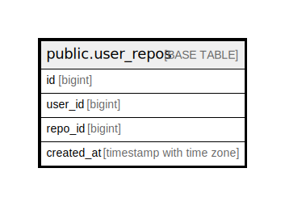

# public.user_repos

## Description

## Columns

| Name       | Type                     | Default | Nullable | Children | Parents | Comment |
| ---------- | ------------------------ | ------- | -------- | -------- | ------- | ------- |
| id         | bigint                   |         | false    |          |         |         |
| user_id    | bigint                   |         | false    |          |         |         |
| repo_id    | bigint                   |         | false    |          |         |         |
| created_at | timestamp with time zone | now()   | true     |          |         |         |

## Constraints

| Name            | Type        | Definition       |
| --------------- | ----------- | ---------------- |
| user_repos_pkey | PRIMARY KEY | PRIMARY KEY (id) |

## Indexes

| Name            | Definition                                                                |
| --------------- | ------------------------------------------------------------------------- |
| user_repos_pkey | CREATE UNIQUE INDEX user_repos_pkey ON public.user_repos USING btree (id) |

## Relations

---

> Generated by [tbls](https://github.com/k1LoW/tbls)
