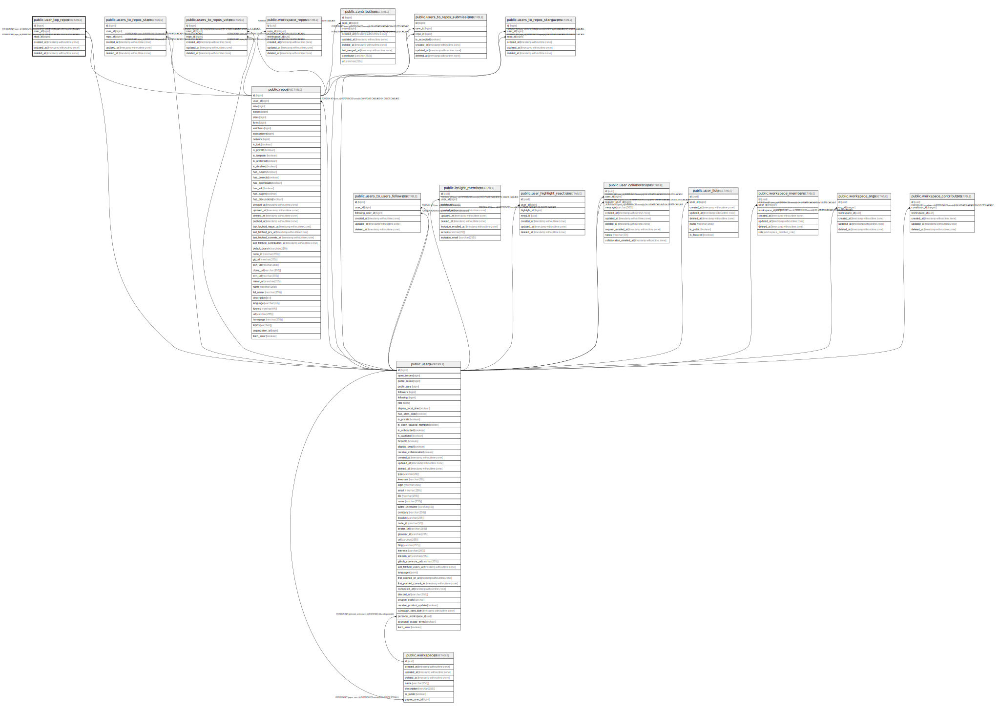

# public.user_top_repos

## Description

## Columns

| Name       | Type                        | Default | Nullable | Children | Parents                         | Comment |
| ---------- | --------------------------- | ------- | -------- | -------- | ------------------------------- | ------- |
| id         | bigint                      |         | false    |          |                                 |         |
| user_id    | bigint                      |         | false    |          | [public.users](public.users.md) |         |
| repo_id    | bigint                      |         | false    |          | [public.repos](public.repos.md) |         |
| created_at | timestamp without time zone | now()   | false    |          |                                 |         |
| updated_at | timestamp without time zone | now()   | false    |          |                                 |         |
| deleted_at | timestamp without time zone |         | true     |          |                                 |         |

## Constraints

| Name                        | Type        | Definition                                                                     |
| --------------------------- | ----------- | ------------------------------------------------------------------------------ |
| user_top_repos_user_id_fkey | FOREIGN KEY | FOREIGN KEY (user_id) REFERENCES users(id) ON UPDATE CASCADE ON DELETE CASCADE |
| user_top_repos_repo_id_fkey | FOREIGN KEY | FOREIGN KEY (repo_id) REFERENCES repos(id) ON UPDATE CASCADE ON DELETE CASCADE |
| user_top_repos_pkey         | PRIMARY KEY | PRIMARY KEY (id)                                                               |
| user_top_repos_hash         | UNIQUE      | UNIQUE (user_id, repo_id)                                                      |

## Indexes

| Name                          | Definition                                                                                      |
| ----------------------------- | ----------------------------------------------------------------------------------------------- |
| user_top_repos_pkey           | CREATE UNIQUE INDEX user_top_repos_pkey ON public.user_top_repos USING btree (id)               |
| user_top_repos_hash           | CREATE UNIQUE INDEX user_top_repos_hash ON public.user_top_repos USING btree (user_id, repo_id) |
| user_top_repos_idx_created_at | CREATE INDEX user_top_repos_idx_created_at ON public.user_top_repos USING btree (created_at)    |
| user_top_repos_idx_updated_at | CREATE INDEX user_top_repos_idx_updated_at ON public.user_top_repos USING btree (updated_at)    |
| user_top_repos_idx_deleted_at | CREATE INDEX user_top_repos_idx_deleted_at ON public.user_top_repos USING btree (deleted_at)    |

## Relations

---

> Generated by [tbls](https://github.com/k1LoW/tbls)
