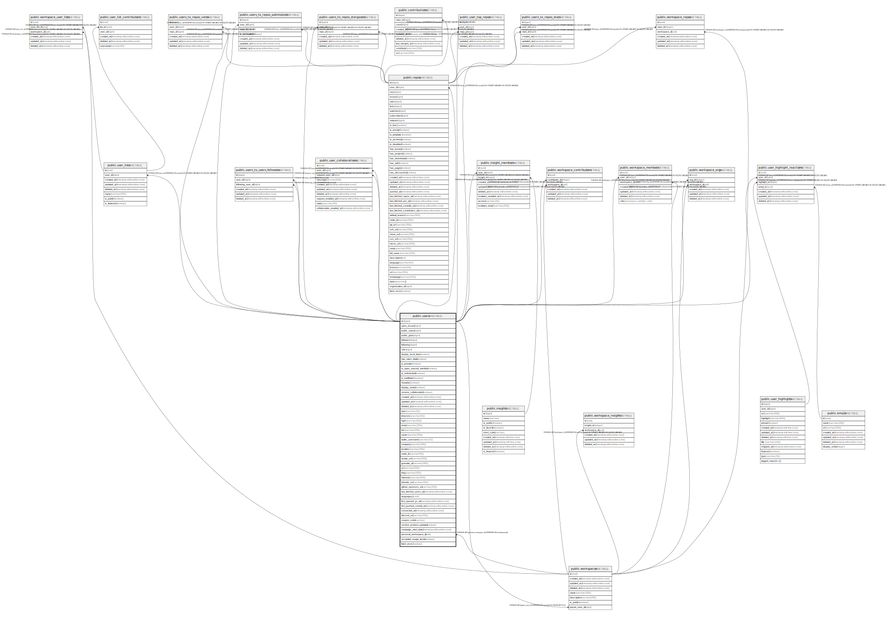

# public.users

## Description

## Columns

| Name                   | Type                        | Default                             | Nullable | Children                                                                                                                                                                                                                                                                                                                                                                                                                                                                                                                                                                                                                    | Parents | Comment |
| ---------------------- | --------------------------- | ----------------------------------- | -------- | --------------------------------------------------------------------------------------------------------------------------------------------------------------------------------------------------------------------------------------------------------------------------------------------------------------------------------------------------------------------------------------------------------------------------------------------------------------------------------------------------------------------------------------------------------------------------------------------------------------------------- | ------- | ------- |
| id                     | bigint                      |                                     | false    | [public.repos](public.repos.md) [public.users_to_repos_stars](public.users_to_repos_stars.md) [public.users_to_repos_votes](public.users_to_repos_votes.md) [public.users_to_repos_submissions](public.users_to_repos_submissions.md) [public.users_to_repos_stargazers](public.users_to_repos_stargazers.md) [public.users_to_users_followers](public.users_to_users_followers.md) [public.insight_members](public.insight_members.md) [public.user_highlight_reactions](public.user_highlight_reactions.md) [public.user_top_repos](public.user_top_repos.md) [public.user_collaborations](public.user_collaborations.md) |         |         |
| open_issues            | bigint                      | 0                                   | false    |                                                                                                                                                                                                                                                                                                                                                                                                                                                                                                                                                                                                                             |         |         |
| public_repos           | bigint                      | 0                                   | false    |                                                                                                                                                                                                                                                                                                                                                                                                                                                                                                                                                                                                                             |         |         |
| public_gists           | bigint                      | 0                                   | false    |                                                                                                                                                                                                                                                                                                                                                                                                                                                                                                                                                                                                                             |         |         |
| followers              | bigint                      | 0                                   | false    |                                                                                                                                                                                                                                                                                                                                                                                                                                                                                                                                                                                                                             |         |         |
| following              | bigint                      | 0                                   | false    |                                                                                                                                                                                                                                                                                                                                                                                                                                                                                                                                                                                                                             |         |         |
| role                   | bigint                      | 10                                  | false    |                                                                                                                                                                                                                                                                                                                                                                                                                                                                                                                                                                                                                             |         |         |
| display_local_time     | boolean                     | false                               | false    |                                                                                                                                                                                                                                                                                                                                                                                                                                                                                                                                                                                                                             |         |         |
| has_stars_data         | boolean                     | false                               | false    |                                                                                                                                                                                                                                                                                                                                                                                                                                                                                                                                                                                                                             |         |         |
| is_private             | boolean                     | false                               | false    |                                                                                                                                                                                                                                                                                                                                                                                                                                                                                                                                                                                                                             |         |         |
| is_open_sauced_member  | boolean                     | false                               | false    |                                                                                                                                                                                                                                                                                                                                                                                                                                                                                                                                                                                                                             |         |         |
| is_onboarded           | boolean                     | false                               | false    |                                                                                                                                                                                                                                                                                                                                                                                                                                                                                                                                                                                                                             |         |         |
| is_waitlisted          | boolean                     | false                               | false    |                                                                                                                                                                                                                                                                                                                                                                                                                                                                                                                                                                                                                             |         |         |
| hireable               | boolean                     | false                               | false    |                                                                                                                                                                                                                                                                                                                                                                                                                                                                                                                                                                                                                             |         |         |
| display_email          | boolean                     | false                               | false    |                                                                                                                                                                                                                                                                                                                                                                                                                                                                                                                                                                                                                             |         |         |
| receive_collaboration  | boolean                     | false                               | false    |                                                                                                                                                                                                                                                                                                                                                                                                                                                                                                                                                                                                                             |         |         |
| created_at             | timestamp without time zone | now()                               | false    |                                                                                                                                                                                                                                                                                                                                                                                                                                                                                                                                                                                                                             |         |         |
| updated_at             | timestamp without time zone | now()                               | false    |                                                                                                                                                                                                                                                                                                                                                                                                                                                                                                                                                                                                                             |         |         |
| deleted_at             | timestamp without time zone |                                     | true     |                                                                                                                                                                                                                                                                                                                                                                                                                                                                                                                                                                                                                             |         |         |
| type                   | varchar(20)                 | 'User'::character varying           | false    |                                                                                                                                                                                                                                                                                                                                                                                                                                                                                                                                                                                                                             |         |         |
| timezone               | varchar(50)                 | 'UTC+1'::character varying          | false    |                                                                                                                                                                                                                                                                                                                                                                                                                                                                                                                                                                                                                             |         |         |
| login                  | varchar(255)                | ''::character varying               | false    |                                                                                                                                                                                                                                                                                                                                                                                                                                                                                                                                                                                                                             |         |         |
| email                  | varchar(255)                | ''::character varying               | false    |                                                                                                                                                                                                                                                                                                                                                                                                                                                                                                                                                                                                                             |         |         |
| bio                    | varchar(255)                | ''::character varying               | false    |                                                                                                                                                                                                                                                                                                                                                                                                                                                                                                                                                                                                                             |         |         |
| name                   | varchar(255)                | ''::character varying               | false    |                                                                                                                                                                                                                                                                                                                                                                                                                                                                                                                                                                                                                             |         |         |
| twitter_username       | varchar(15)                 | ''::character varying               | false    |                                                                                                                                                                                                                                                                                                                                                                                                                                                                                                                                                                                                                             |         |         |
| company                | varchar(255)                | ''::character varying               | false    |                                                                                                                                                                                                                                                                                                                                                                                                                                                                                                                                                                                                                             |         |         |
| location               | varchar(255)                | ''::character varying               | false    |                                                                                                                                                                                                                                                                                                                                                                                                                                                                                                                                                                                                                             |         |         |
| node_id                | varchar(50)                 | ''::character varying               | false    |                                                                                                                                                                                                                                                                                                                                                                                                                                                                                                                                                                                                                             |         |         |
| avatar_url             | varchar(255)                | ''::character varying               | false    |                                                                                                                                                                                                                                                                                                                                                                                                                                                                                                                                                                                                                             |         |         |
| gravatar_id            | varchar(255)                | ''::character varying               | false    |                                                                                                                                                                                                                                                                                                                                                                                                                                                                                                                                                                                                                             |         |         |
| url                    | varchar(255)                | ''::character varying               | false    |                                                                                                                                                                                                                                                                                                                                                                                                                                                                                                                                                                                                                             |         |         |
| blog                   | varchar(255)                | ''::character varying               | false    |                                                                                                                                                                                                                                                                                                                                                                                                                                                                                                                                                                                                                             |         |         |
| interests              | varchar(200)                | 'javascript'::character varying     | false    |                                                                                                                                                                                                                                                                                                                                                                                                                                                                                                                                                                                                                             |         |         |
| linkedin_url           | varchar(255)                | ''::character varying               | false    |                                                                                                                                                                                                                                                                                                                                                                                                                                                                                                                                                                                                                             |         |         |
| github_sponsors_url    | varchar(255)                | ''::character varying               | false    |                                                                                                                                                                                                                                                                                                                                                                                                                                                                                                                                                                                                                             |         |         |
| last_fetched_users_at  | timestamp without time zone | to_timestamp((0)::double precision) | true     |                                                                                                                                                                                                                                                                                                                                                                                                                                                                                                                                                                                                                             |         |         |
| languages              | jsonb                       | '{}'::jsonb                         | false    |                                                                                                                                                                                                                                                                                                                                                                                                                                                                                                                                                                                                                             |         |         |
| first_opened_pr_at     | timestamp without time zone |                                     | true     |                                                                                                                                                                                                                                                                                                                                                                                                                                                                                                                                                                                                                             |         |         |
| first_pushed_commit_at | timestamp without time zone |                                     | true     |                                                                                                                                                                                                                                                                                                                                                                                                                                                                                                                                                                                                                             |         |         |
| connected_at           | timestamp without time zone |                                     | true     |                                                                                                                                                                                                                                                                                                                                                                                                                                                                                                                                                                                                                             |         |         |
| discord_url            | varchar(255)                | ''::character varying               | false    |                                                                                                                                                                                                                                                                                                                                                                                                                                                                                                                                                                                                                             |         |         |

## Constraints

| Name       | Type        | Definition       |
| ---------- | ----------- | ---------------- |
| users_pkey | PRIMARY KEY | PRIMARY KEY (id) |

## Indexes

| Name                            | Definition                                                                                       |
| ------------------------------- | ------------------------------------------------------------------------------------------------ |
| users_pkey                      | CREATE UNIQUE INDEX users_pkey ON public.users USING btree (id)                                  |
| users_idx_open_issues           | CREATE INDEX users_idx_open_issues ON public.users USING btree (open_issues)                     |
| users_idx_public_repos          | CREATE INDEX users_idx_public_repos ON public.users USING btree (public_repos)                   |
| users_idx_public_gists          | CREATE INDEX users_idx_public_gists ON public.users USING btree (public_gists)                   |
| users_idx_followers             | CREATE INDEX users_idx_followers ON public.users USING btree (followers)                         |
| users_idx_following             | CREATE INDEX users_idx_following ON public.users USING btree (following)                         |
| users_idx_role                  | CREATE INDEX users_idx_role ON public.users USING btree (role)                                   |
| users_idx_display_local_time    | CREATE INDEX users_idx_display_local_time ON public.users USING btree (display_local_time)       |
| users_idx_has_stars_data        | CREATE INDEX users_idx_has_stars_data ON public.users USING btree (has_stars_data)               |
| users_idx_is_private            | CREATE INDEX users_idx_is_private ON public.users USING btree (is_private)                       |
| users_idx_is_open_sauced_member | CREATE INDEX users_idx_is_open_sauced_member ON public.users USING btree (is_open_sauced_member) |
| users_idx_is_onboarded          | CREATE INDEX users_idx_is_onboarded ON public.users USING btree (is_onboarded)                   |
| users_idx_is_waitlisted         | CREATE INDEX users_idx_is_waitlisted ON public.users USING btree (is_waitlisted)                 |
| users_idx_hireable              | CREATE INDEX users_idx_hireable ON public.users USING btree (hireable)                           |
| users_idx_display_email         | CREATE INDEX users_idx_display_email ON public.users USING btree (display_email)                 |
| users_idx_receive_collaboration | CREATE INDEX users_idx_receive_collaboration ON public.users USING btree (receive_collaboration) |
| users_idx_created_at            | CREATE INDEX users_idx_created_at ON public.users USING btree (created_at)                       |
| users_idx_updated_at            | CREATE INDEX users_idx_updated_at ON public.users USING btree (updated_at)                       |
| users_idx_deleted_at            | CREATE INDEX users_idx_deleted_at ON public.users USING btree (deleted_at)                       |
| users_idx_email                 | CREATE INDEX users_idx_email ON public.users USING btree (email)                                 |
| users_idx_node_id               | CREATE INDEX users_idx_node_id ON public.users USING btree (node_id)                             |
| users_idx_type                  | CREATE INDEX users_idx_type ON public.users USING btree (type)                                   |
| users_idx_timezone              | CREATE INDEX users_idx_timezone ON public.users USING btree (timezone)                           |
| users_idx_location              | CREATE INDEX users_idx_location ON public.users USING btree (location)                           |
| users_idx_name                  | CREATE INDEX users_idx_name ON public.users USING btree (name)                                   |
| users_login_key                 | CREATE UNIQUE INDEX users_login_key ON public.users USING btree (lower((login)::text))           |
| users_idx_languages             | CREATE INDEX users_idx_languages ON public.users USING gin (languages jsonb_path_ops)            |
| users_idx_first_opened_pr_at    | CREATE INDEX users_idx_first_opened_pr_at ON public.users USING btree (first_opened_pr_at)       |
| users_idx_connected_at          | CREATE INDEX users_idx_connected_at ON public.users USING btree (connected_at)                   |

## Relations

---

> Generated by [tbls](https://github.com/k1LoW/tbls)
