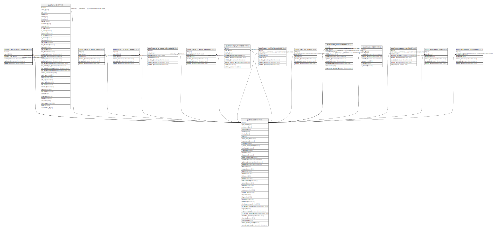

# public.users_to_users_followers

## Description

## Columns

| Name              | Type                        | Default | Nullable | Children | Parents                         | Comment |
| ----------------- | --------------------------- | ------- | -------- | -------- | ------------------------------- | ------- |
| id                | bigint                      |         | false    |          |                                 |         |
| user_id           | bigint                      |         | false    |          | [public.users](public.users.md) |         |
| following_user_id | bigint                      |         | false    |          | [public.users](public.users.md) |         |
| created_at        | timestamp without time zone | now()   | false    |          |                                 |         |
| updated_at        | timestamp without time zone | now()   | false    |          |                                 |         |
| deleted_at        | timestamp without time zone |         | true     |          |                                 |         |

## Constraints

| Name                                            | Type        | Definition                                           |
| ----------------------------------------------- | ----------- | ---------------------------------------------------- |
| users_to_users_followers_following_user_id_fkey | FOREIGN KEY | FOREIGN KEY (following_user_id) REFERENCES users(id) |
| users_to_users_followers_user_id_fkey           | FOREIGN KEY | FOREIGN KEY (user_id) REFERENCES users(id)           |
| followers_pkey                                  | PRIMARY KEY | PRIMARY KEY (id)                                     |
| followers_hash                                  | UNIQUE      | UNIQUE (user_id, following_user_id)                  |

## Indexes

| Name           | Definition                                                                                                     |
| -------------- | -------------------------------------------------------------------------------------------------------------- |
| followers_pkey | CREATE UNIQUE INDEX followers_pkey ON public.users_to_users_followers USING btree (id)                         |
| followers_hash | CREATE UNIQUE INDEX followers_hash ON public.users_to_users_followers USING btree (user_id, following_user_id) |

## Relations

---

> Generated by [tbls](https://github.com/k1LoW/tbls)
