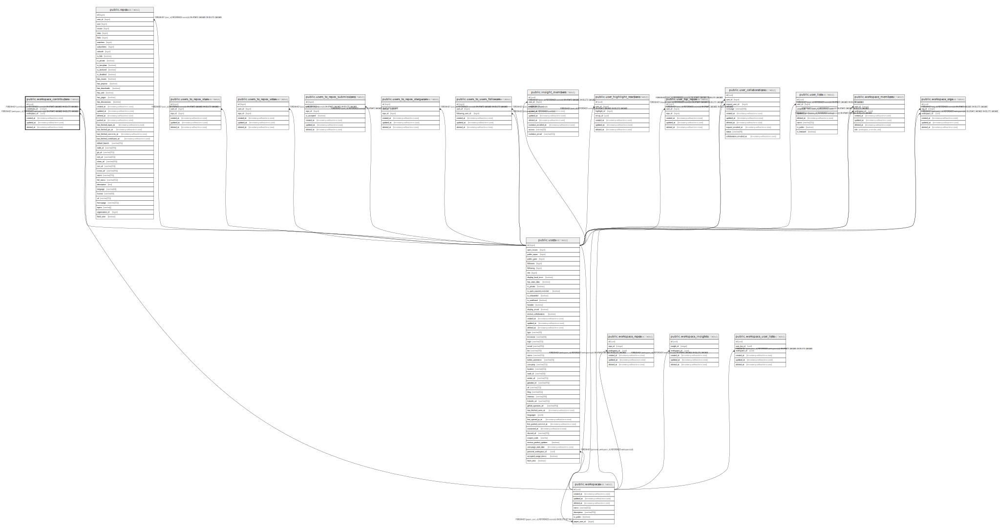

# public.workspace_contributors

## Description

## Columns

| Name           | Type                        | Default            | Nullable | Children | Parents                                   | Comment |
| -------------- | --------------------------- | ------------------ | -------- | -------- | ----------------------------------------- | ------- |
| id             | uuid                        | uuid_generate_v4() | false    |          |                                           |         |
| contributor_id | integer                     |                    | false    |          | [public.users](public.users.md)           |         |
| workspace_id   | uuid                        |                    | false    |          | [public.workspaces](public.workspaces.md) |         |
| created_at     | timestamp without time zone | now()              | false    |          |                                           |         |
| updated_at     | timestamp without time zone | now()              | false    |          |                                           |         |
| deleted_at     | timestamp without time zone |                    | true     |          |                                           |         |

## Constraints

| Name                                       | Type        | Definition                                                                               |
| ------------------------------------------ | ----------- | ---------------------------------------------------------------------------------------- |
| workspace_contributors_contributor_id_fkey | FOREIGN KEY | FOREIGN KEY (contributor_id) REFERENCES users(id) ON UPDATE CASCADE ON DELETE CASCADE    |
| workspace_contributors_workspace_id_fkey   | FOREIGN KEY | FOREIGN KEY (workspace_id) REFERENCES workspaces(id) ON UPDATE CASCADE ON DELETE CASCADE |
| workspace_contributors_pkey                | PRIMARY KEY | PRIMARY KEY (id)                                                                         |

## Indexes

| Name                                    | Definition                                                                                                       |
| --------------------------------------- | ---------------------------------------------------------------------------------------------------------------- |
| workspace_contributors_pkey             | CREATE UNIQUE INDEX workspace_contributors_pkey ON public.workspace_contributors USING btree (id)                |
| workspace_contributors_idx_id           | CREATE INDEX workspace_contributors_idx_id ON public.workspace_contributors USING btree (id)                     |
| workspace_contributors_idx_user_id      | CREATE INDEX workspace_contributors_idx_user_id ON public.workspace_contributors USING btree (contributor_id)    |
| workspace_contributors_idx_workspace_id | CREATE INDEX workspace_contributors_idx_workspace_id ON public.workspace_contributors USING btree (workspace_id) |
| workspace_contributors_idx_created_at   | CREATE INDEX workspace_contributors_idx_created_at ON public.workspace_contributors USING btree (created_at)     |
| workspace_contributors_idx_updated_at   | CREATE INDEX workspace_contributors_idx_updated_at ON public.workspace_contributors USING btree (updated_at)     |
| workspace_contributors_idx_deleted_at   | CREATE INDEX workspace_contributors_idx_deleted_at ON public.workspace_contributors USING btree (deleted_at)     |

## Relations

---

> Generated by [tbls](https://github.com/k1LoW/tbls)
