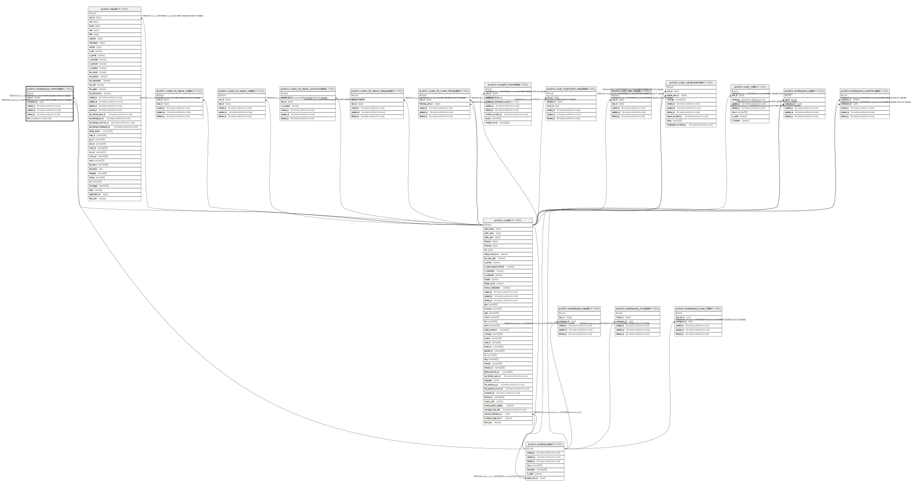

# public.workspace_members

## Description

## Columns

| Name         | Type                        | Default                         | Nullable | Children | Parents                                   | Comment |
| ------------ | --------------------------- | ------------------------------- | -------- | -------- | ----------------------------------------- | ------- |
| id           | uuid                        | uuid_generate_v4()              | false    |          |                                           |         |
| user_id      | integer                     |                                 | false    |          | [public.users](public.users.md)           |         |
| workspace_id | uuid                        |                                 | false    |          | [public.workspaces](public.workspaces.md) |         |
| created_at   | timestamp without time zone | now()                           | false    |          |                                           |         |
| updated_at   | timestamp without time zone | now()                           | false    |          |                                           |         |
| deleted_at   | timestamp without time zone |                                 | true     |          |                                           |         |
| role         | workspace_member_role       | 'viewer'::workspace_member_role | false    |          |                                           |         |

## Constraints

| Name                                | Type        | Definition                                                                               |
| ----------------------------------- | ----------- | ---------------------------------------------------------------------------------------- |
| workspace_members_user_id_fkey      | FOREIGN KEY | FOREIGN KEY (user_id) REFERENCES users(id) ON UPDATE CASCADE ON DELETE CASCADE           |
| workspace_members_workspace_id_fkey | FOREIGN KEY | FOREIGN KEY (workspace_id) REFERENCES workspaces(id) ON UPDATE CASCADE ON DELETE CASCADE |
| workspace_members_pkey              | PRIMARY KEY | PRIMARY KEY (id)                                                                         |

## Indexes

| Name                               | Definition                                                                                             |
| ---------------------------------- | ------------------------------------------------------------------------------------------------------ |
| workspace_members_pkey             | CREATE UNIQUE INDEX workspace_members_pkey ON public.workspace_members USING btree (id)                |
| workspace_members_idx_id           | CREATE INDEX workspace_members_idx_id ON public.workspace_members USING btree (id)                     |
| workspace_members_idx_user_id      | CREATE INDEX workspace_members_idx_user_id ON public.workspace_members USING btree (user_id)           |
| workspace_members_idx_workspace_id | CREATE INDEX workspace_members_idx_workspace_id ON public.workspace_members USING btree (workspace_id) |
| workspace_members_idx_role         | CREATE INDEX workspace_members_idx_role ON public.workspace_members USING btree (role)                 |
| workspace_members_idx_created_at   | CREATE INDEX workspace_members_idx_created_at ON public.workspace_members USING btree (created_at)     |
| workspace_members_idx_updated_at   | CREATE INDEX workspace_members_idx_updated_at ON public.workspace_members USING btree (updated_at)     |
| workspace_members_idx_deleted_at   | CREATE INDEX workspace_members_idx_deleted_at ON public.workspace_members USING btree (deleted_at)     |

## Relations

---

> Generated by [tbls](https://github.com/k1LoW/tbls)
