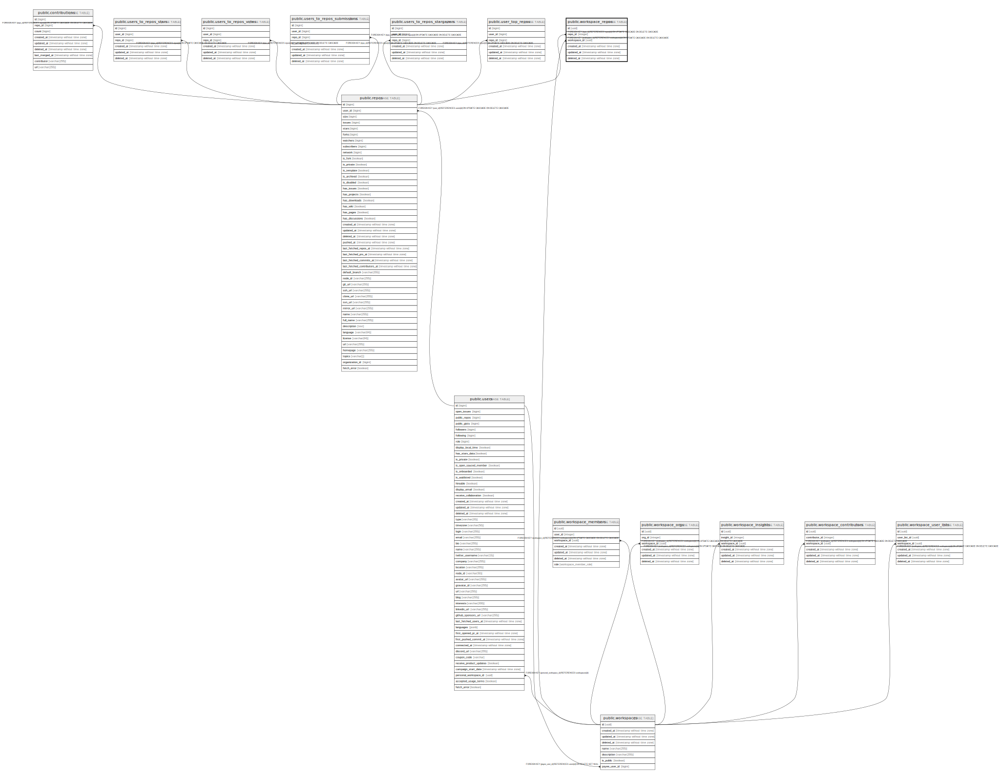

# public.workspace_repos

## Description

## Columns

| Name         | Type                        | Default            | Nullable | Children | Parents                                   | Comment |
| ------------ | --------------------------- | ------------------ | -------- | -------- | ----------------------------------------- | ------- |
| id           | uuid                        | uuid_generate_v4() | false    |          |                                           |         |
| repo_id      | integer                     |                    | false    |          | [public.repos](public.repos.md)           |         |
| workspace_id | uuid                        |                    | false    |          | [public.workspaces](public.workspaces.md) |         |
| created_at   | timestamp without time zone | now()              | false    |          |                                           |         |
| updated_at   | timestamp without time zone | now()              | false    |          |                                           |         |
| deleted_at   | timestamp without time zone |                    | true     |          |                                           |         |

## Constraints

| Name                              | Type        | Definition                                                                               |
| --------------------------------- | ----------- | ---------------------------------------------------------------------------------------- |
| workspace_repos_repo_id_fkey      | FOREIGN KEY | FOREIGN KEY (repo_id) REFERENCES repos(id) ON UPDATE CASCADE ON DELETE CASCADE           |
| workspace_repos_workspace_id_fkey | FOREIGN KEY | FOREIGN KEY (workspace_id) REFERENCES workspaces(id) ON UPDATE CASCADE ON DELETE CASCADE |
| workspace_repos_pkey              | PRIMARY KEY | PRIMARY KEY (id)                                                                         |

## Indexes

| Name                             | Definition                                                                                         |
| -------------------------------- | -------------------------------------------------------------------------------------------------- |
| workspace_repos_pkey             | CREATE UNIQUE INDEX workspace_repos_pkey ON public.workspace_repos USING btree (id)                |
| workspace_repos_idx_id           | CREATE INDEX workspace_repos_idx_id ON public.workspace_repos USING btree (id)                     |
| workspace_repos_idx_user_id      | CREATE INDEX workspace_repos_idx_user_id ON public.workspace_repos USING btree (repo_id)           |
| workspace_repos_idx_workspace_id | CREATE INDEX workspace_repos_idx_workspace_id ON public.workspace_repos USING btree (workspace_id) |
| workspace_repos_idx_created_at   | CREATE INDEX workspace_repos_idx_created_at ON public.workspace_repos USING btree (created_at)     |
| workspace_repos_idx_updated_at   | CREATE INDEX workspace_repos_idx_updated_at ON public.workspace_repos USING btree (updated_at)     |
| workspace_repos_idx_deleted_at   | CREATE INDEX workspace_repos_idx_deleted_at ON public.workspace_repos USING btree (deleted_at)     |

## Relations

---

> Generated by [tbls](https://github.com/k1LoW/tbls)
