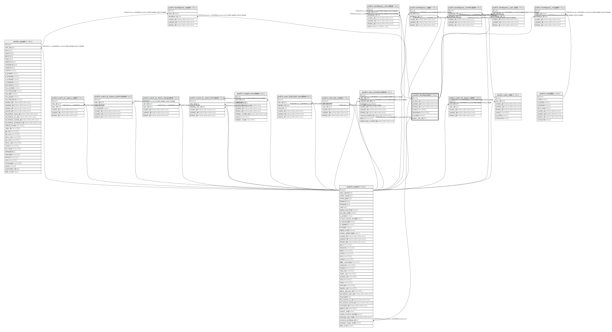

# public.workspaces

## Description

## Columns

| Name        | Type                        | Default            | Nullable | Children                                                                                                                                                                                                                                                                                  | Parents | Comment |
| ----------- | --------------------------- | ------------------ | -------- | ----------------------------------------------------------------------------------------------------------------------------------------------------------------------------------------------------------------------------------------------------------------------------------------- | ------- | ------- |
| id          | uuid                        | uuid_generate_v4() | false    | [public.workspace_members](public.workspace_members.md) [public.workspace_orgs](public.workspace_orgs.md) [public.workspace_repos](public.workspace_repos.md) [public.workspace_insights](public.workspace_insights.md) [public.workspace_contributors](public.workspace_contributors.md) |         |         |
| created_at  | timestamp without time zone | now()              | false    |                                                                                                                                                                                                                                                                                           |         |         |
| updated_at  | timestamp without time zone | now()              | false    |                                                                                                                                                                                                                                                                                           |         |         |
| deleted_at  | timestamp without time zone |                    | true     |                                                                                                                                                                                                                                                                                           |         |         |
| name        | varchar(255)                |                    | false    |                                                                                                                                                                                                                                                                                           |         |         |
| description | varchar(255)                |                    | false    |                                                                                                                                                                                                                                                                                           |         |         |

## Constraints

| Name            | Type        | Definition       |
| --------------- | ----------- | ---------------- |
| workspaces_pkey | PRIMARY KEY | PRIMARY KEY (id) |

## Indexes

| Name                      | Definition                                                                           |
| ------------------------- | ------------------------------------------------------------------------------------ |
| workspaces_pkey           | CREATE UNIQUE INDEX workspaces_pkey ON public.workspaces USING btree (id)            |
| workspaces_idx_id         | CREATE INDEX workspaces_idx_id ON public.workspaces USING btree (id)                 |
| workspaces_idx_created_at | CREATE INDEX workspaces_idx_created_at ON public.workspaces USING btree (created_at) |
| workspaces_idx_updated_at | CREATE INDEX workspaces_idx_updated_at ON public.workspaces USING btree (updated_at) |
| workspaces_idx_deleted_at | CREATE INDEX workspaces_idx_deleted_at ON public.workspaces USING btree (deleted_at) |

## Relations

---

> Generated by [tbls](https://github.com/k1LoW/tbls)
