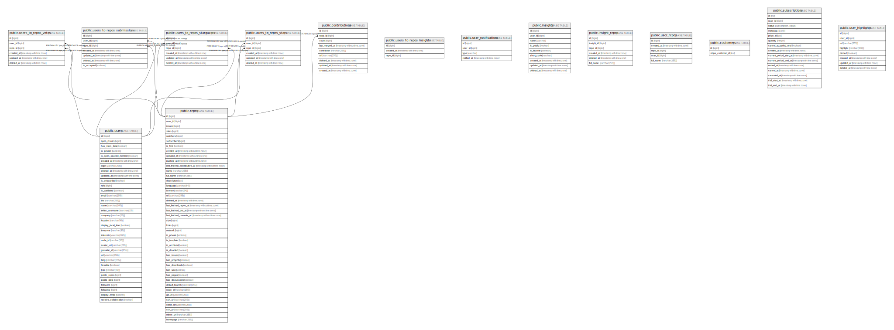

# hot.opensauced.pizza supabase

## Description

🍕 The backend for the site that recommends the hottest projects on GitHub.

## Tables

| Name                                                                      | Columns | Comment                           | Type       |
| ------------------------------------------------------------------------- | ------- | --------------------------------- | ---------- |
| [public.repos](public.repos.md)                                           | 42      |                                   | BASE TABLE |
| [public.contributions](public.contributions.md)                           | 9       |                                   | BASE TABLE |
| [public.users](public.users.md)                                           | 36      |                                   | BASE TABLE |
| [public.users_to_repos_stars](public.users_to_repos_stars.md)             | 6       |                                   | BASE TABLE |
| [public.users_to_repos_votes](public.users_to_repos_votes.md)             | 6       |                                   | BASE TABLE |
| [public.users_to_repos_submissions](public.users_to_repos_submissions.md) | 7       |                                   | BASE TABLE |
| [public.users_to_repos_stargazers](public.users_to_repos_stargazers.md)   | 6       |                                   | BASE TABLE |
| [public.users_to_repos_insights](public.users_to_repos_insights.md)       | 3       |                                   | BASE TABLE |
| [public.user_notifications](public.user_notifications.md)                 | 4       | Record of user notifications sent | BASE TABLE |
| [public.insights](public.insights.md)                                     | 9       | Insight Pages                     | BASE TABLE |
| [public.insight_repos](public.insight_repos.md)                           | 6       | Insights Repositories             | BASE TABLE |
| [public.user_repos](public.user_repos.md)                                 | 5       |                                   | BASE TABLE |
| [public.customers](public.customers.md)                                   | 2       |                                   | BASE TABLE |
| [public.subscriptions](public.subscriptions.md)                           | 15      |                                   | BASE TABLE |
| [public.user_highlights](public.user_highlights.md)                       | 9       |                                   | BASE TABLE |

## Relations

---

> Generated by [tbls](https://github.com/k1LoW/tbls)
