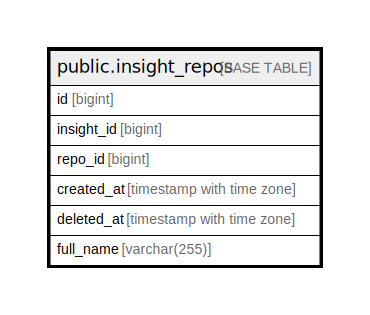

# public.insight_repos

## Description

Insights Repositories

## Columns

| Name       | Type                     | Default | Nullable | Children | Parents | Comment |
| ---------- | ------------------------ | ------- | -------- | -------- | ------- | ------- |
| id         | bigint                   |         | false    |          |         |         |
| insight_id | bigint                   |         | false    |          |         |         |
| repo_id    | bigint                   |         | false    |          |         |         |
| created_at | timestamp with time zone | now()   | true     |          |         |         |
| deleted_at | timestamp with time zone |         | true     |          |         |         |

## Constraints

| Name                   | Type        | Definition       |
| ---------------------- | ----------- | ---------------- |
| insights_to_repos_pkey | PRIMARY KEY | PRIMARY KEY (id) |

## Indexes

| Name                   | Definition                                                                          |
| ---------------------- | ----------------------------------------------------------------------------------- |
| insights_to_repos_pkey | CREATE UNIQUE INDEX insights_to_repos_pkey ON public.insight_repos USING btree (id) |

## Relations

---

> Generated by [tbls](https://github.com/k1LoW/tbls)
