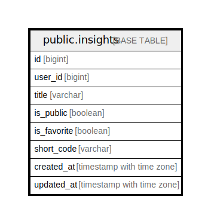

# public.insights

## Description

Insight Pages

## Columns

| Name        | Type                     | Default | Nullable | Children | Parents | Comment |
| ----------- | ------------------------ | ------- | -------- | -------- | ------- | ------- |
| id          | bigint                   |         | false    |          |         |         |
| user_id     | bigint                   |         | false    |          |         |         |
| name        | varchar                  |         | false    |          |         |         |
| is_public   | boolean                  | false   | true     |          |         |         |
| is_favorite | boolean                  | false   | true     |          |         |         |
| short_code  | varchar                  |         | true     |          |         |         |
| created_at  | timestamp with time zone | now()   | true     |          |         |         |
| updated_at  | timestamp with time zone | now()   | true     |          |         |         |
| deleted_at  | timestamp with time zone |         | true     |          |         |         |

## Constraints

| Name          | Type        | Definition       |
| ------------- | ----------- | ---------------- |
| insights_pkey | PRIMARY KEY | PRIMARY KEY (id) |

## Indexes

| Name          | Definition                                                            |
| ------------- | --------------------------------------------------------------------- |
| insights_pkey | CREATE UNIQUE INDEX insights_pkey ON public.insights USING btree (id) |

## Relations

---

> Generated by [tbls](https://github.com/k1LoW/tbls)
