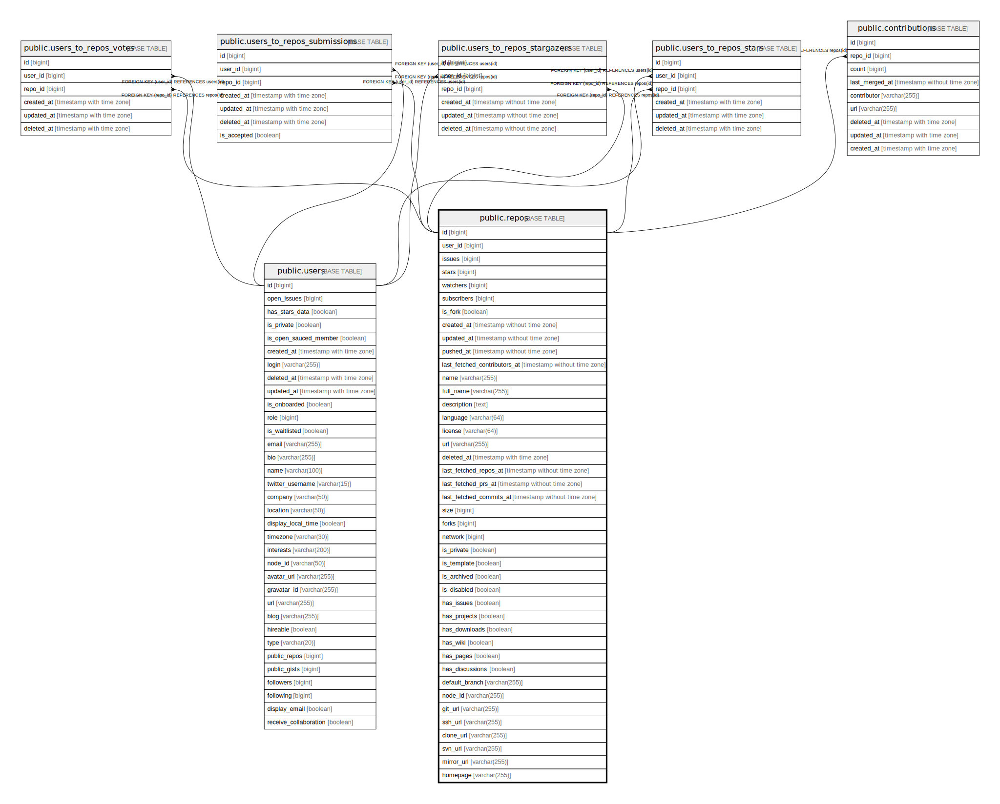

# public.repos

## Description

## Columns

| Name                         | Type                        | Default                             | Nullable | Children                                                                                                                                                                                                                                                                                                                      | Parents | Comment |
| ---------------------------- | --------------------------- | ----------------------------------- | -------- | ----------------------------------------------------------------------------------------------------------------------------------------------------------------------------------------------------------------------------------------------------------------------------------------------------------------------------- | ------- | ------- |
| id                           | bigint                      |                                     | false    | [public.contributions](public.contributions.md) [public.users_to_repos_stars](public.users_to_repos_stars.md) [public.users_to_repos_votes](public.users_to_repos_votes.md) [public.users_to_repos_submissions](public.users_to_repos_submissions.md) [public.users_to_repos_stargazers](public.users_to_repos_stargazers.md) |         |         |
| user_id                      | bigint                      |                                     | false    |                                                                                                                                                                                                                                                                                                                               |         |         |
| issues                       | bigint                      | 0                                   | false    |                                                                                                                                                                                                                                                                                                                               |         |         |
| stars                        | bigint                      | 0                                   | false    |                                                                                                                                                                                                                                                                                                                               |         |         |
| watchers                     | bigint                      | 0                                   | false    |                                                                                                                                                                                                                                                                                                                               |         |         |
| subscribers                  | bigint                      | 0                                   | false    |                                                                                                                                                                                                                                                                                                                               |         |         |
| is_fork                      | boolean                     | false                               | false    |                                                                                                                                                                                                                                                                                                                               |         |         |
| created_at                   | timestamp without time zone | now()                               | true     |                                                                                                                                                                                                                                                                                                                               |         |         |
| updated_at                   | timestamp without time zone | now()                               | true     |                                                                                                                                                                                                                                                                                                                               |         |         |
| pushed_at                    | timestamp without time zone | now()                               | true     |                                                                                                                                                                                                                                                                                                                               |         |         |
| last_fetched_contributors_at | timestamp without time zone | to_timestamp((0)::double precision) | true     |                                                                                                                                                                                                                                                                                                                               |         |         |
| name                         | varchar(255)                |                                     | true     |                                                                                                                                                                                                                                                                                                                               |         |         |
| full_name                    | varchar(255)                |                                     | true     |                                                                                                                                                                                                                                                                                                                               |         |         |
| description                  | text                        |                                     | true     |                                                                                                                                                                                                                                                                                                                               |         |         |
| language                     | varchar(64)                 |                                     | true     |                                                                                                                                                                                                                                                                                                                               |         |         |
| license                      | varchar(64)                 |                                     | true     |                                                                                                                                                                                                                                                                                                                               |         |         |
| url                          | varchar(255)                |                                     | true     |                                                                                                                                                                                                                                                                                                                               |         |         |
| deleted_at                   | timestamp with time zone    |                                     | true     |                                                                                                                                                                                                                                                                                                                               |         |         |
| last_fetched_repos_at        | timestamp without time zone | to_timestamp((0)::double precision) | false    |                                                                                                                                                                                                                                                                                                                               |         |         |
| last_fetched_prs_at          | timestamp without time zone | to_timestamp((0)::double precision) | false    |                                                                                                                                                                                                                                                                                                                               |         |         |
| last_fetched_commits_at      | timestamp without time zone | to_timestamp((0)::double precision) | false    |                                                                                                                                                                                                                                                                                                                               |         |         |
| size                         | bigint                      | 0                                   | false    |                                                                                                                                                                                                                                                                                                                               |         |         |
| forks                        | bigint                      | 0                                   | false    |                                                                                                                                                                                                                                                                                                                               |         |         |
| network                      | bigint                      | 0                                   | false    |                                                                                                                                                                                                                                                                                                                               |         |         |
| is_private                   | boolean                     | false                               | false    |                                                                                                                                                                                                                                                                                                                               |         |         |
| is_template                  | boolean                     | false                               | false    |                                                                                                                                                                                                                                                                                                                               |         |         |
| is_archived                  | boolean                     | false                               | false    |                                                                                                                                                                                                                                                                                                                               |         |         |
| is_disabled                  | boolean                     | false                               | false    |                                                                                                                                                                                                                                                                                                                               |         |         |
| has_issues                   | boolean                     | true                                | false    |                                                                                                                                                                                                                                                                                                                               |         |         |
| has_projects                 | boolean                     | true                                | false    |                                                                                                                                                                                                                                                                                                                               |         |         |
| has_downloads                | boolean                     | true                                | false    |                                                                                                                                                                                                                                                                                                                               |         |         |
| has_wiki                     | boolean                     | true                                | false    |                                                                                                                                                                                                                                                                                                                               |         |         |
| has_pages                    | boolean                     | true                                | false    |                                                                                                                                                                                                                                                                                                                               |         |         |
| has_discussions              | boolean                     | true                                | false    |                                                                                                                                                                                                                                                                                                                               |         |         |
| default_branch               | varchar(255)                | 'main'::character varying           | false    |                                                                                                                                                                                                                                                                                                                               |         |         |
| node_id                      | varchar(255)                | ''::character varying               | false    |                                                                                                                                                                                                                                                                                                                               |         |         |
| git_url                      | varchar(255)                | ''::character varying               | false    |                                                                                                                                                                                                                                                                                                                               |         |         |
| ssh_url                      | varchar(255)                | ''::character varying               | false    |                                                                                                                                                                                                                                                                                                                               |         |         |
| clone_url                    | varchar(255)                | ''::character varying               | false    |                                                                                                                                                                                                                                                                                                                               |         |         |
| svn_url                      | varchar(255)                | ''::character varying               | false    |                                                                                                                                                                                                                                                                                                                               |         |         |
| mirror_url                   | varchar(255)                | ''::character varying               | false    |                                                                                                                                                                                                                                                                                                                               |         |         |
| homepage                     | varchar(255)                | ''::character varying               | false    |                                                                                                                                                                                                                                                                                                                               |         |         |

## Constraints

| Name            | Type        | Definition       |
| --------------- | ----------- | ---------------- |
| user_stars_pkey | PRIMARY KEY | PRIMARY KEY (id) |

## Indexes

| Name            | Definition                                                           |
| --------------- | -------------------------------------------------------------------- |
| user_stars_pkey | CREATE UNIQUE INDEX user_stars_pkey ON public.repos USING btree (id) |

## Relations

---

> Generated by [tbls](https://github.com/k1LoW/tbls)
