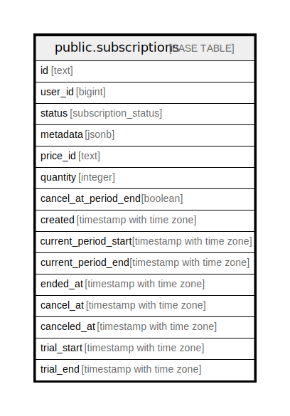

# public.subscriptions

## Description

## Columns

| Name                    | Type                     | Default                      | Nullable | Children | Parents | Comment |
| ----------------------- | ------------------------ | ---------------------------- | -------- | -------- | ------- | ------- |
| id                      | text                     |                              | false    |          |         |         |
| user_id                 | bigint                   |                              | false    |          |         |         |
| status                  | subscription_status      |                              | true     |          |         |         |
| metadata                | jsonb                    |                              | true     |          |         |         |
| price_id                | text                     |                              | true     |          |         |         |
| quantity                | integer                  |                              | true     |          |         |         |
| cancel_at_period_end    | boolean                  |                              | true     |          |         |         |
| created_at              | timestamp with time zone | timezone('utc'::text, now()) | false    |          |         |         |
| current_period_start_at | timestamp with time zone | timezone('utc'::text, now()) | false    |          |         |         |
| current_period_end_at   | timestamp with time zone | timezone('utc'::text, now()) | false    |          |         |         |
| ended_at                | timestamp with time zone |                              | true     |          |         |         |
| cancel_at               | timestamp with time zone |                              | true     |          |         |         |
| canceled_at             | timestamp with time zone |                              | true     |          |         |         |
| trial_start_at          | timestamp with time zone |                              | true     |          |         |         |
| trial_end_at            | timestamp with time zone |                              | true     |          |         |         |

## Constraints

| Name               | Type        | Definition       |
| ------------------ | ----------- | ---------------- |
| subscriptions_pkey | PRIMARY KEY | PRIMARY KEY (id) |

## Indexes

| Name               | Definition                                                                      |
| ------------------ | ------------------------------------------------------------------------------- |
| subscriptions_pkey | CREATE UNIQUE INDEX subscriptions_pkey ON public.subscriptions USING btree (id) |

## Relations

---

> Generated by [tbls](https://github.com/k1LoW/tbls)
