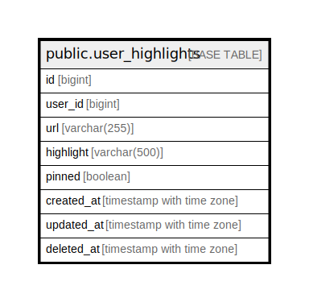

# public.user_highlights

## Description

## Columns

| Name       | Type                | Default | Nullable | Children | Parents | Comment |
| ---------- | ------------------- | ------- | -------- | -------- | ------- | ------- |
| id         | bigint              |         | false    |          |         |         |
| user_id    | bigint              |         | false    |          |         |         |
| url        | varchar(255)        |         | true     |          |         |         |
| highlight  | varchar(500)        |         | false    |          |         |         |
| created_at | time with time zone | now()   | false    |          |         |         |
| updated_at | time with time zone | now()   | false    |          |         |         |
| deleted_at | time with time zone |         | true     |          |         |         |
| pinned     | boolean             | false   | false    |          |         |         |

## Constraints

| Name                 | Type        | Definition       |
| -------------------- | ----------- | ---------------- |
| user_highlights_pkey | PRIMARY KEY | PRIMARY KEY (id) |

## Indexes

| Name                 | Definition                                                                          |
| -------------------- | ----------------------------------------------------------------------------------- |
| user_highlights_pkey | CREATE UNIQUE INDEX user_highlights_pkey ON public.user_highlights USING btree (id) |

## Relations

---

> Generated by [tbls](https://github.com/k1LoW/tbls)
