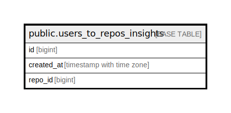

# public.users_to_repos_insights

## Description

## Columns

| Name       | Type                     | Default | Nullable | Children | Parents | Comment |
| ---------- | ------------------------ | ------- | -------- | -------- | ------- | ------- |
| id         | bigint                   |         | false    |          |         |         |
| created_at | timestamp with time zone | now()   | true     |          |         |         |
| repo_id    | bigint                   |         | true     |          |         |         |

## Constraints

| Name                         | Type        | Definition       |
| ---------------------------- | ----------- | ---------------- |
| users_to_repos_insights_pkey | PRIMARY KEY | PRIMARY KEY (id) |

## Indexes

| Name                         | Definition                                                                                          |
| ---------------------------- | --------------------------------------------------------------------------------------------------- |
| users_to_repos_insights_pkey | CREATE UNIQUE INDEX users_to_repos_insights_pkey ON public.users_to_repos_insights USING btree (id) |

## Relations

---

> Generated by [tbls](https://github.com/k1LoW/tbls)
